R Notebook - data from MSSE Weng et al., 2015
================
Michelle Voss
Nov 2018

**Citation**: Weng, T. B., Pierce, G. L., Darling, W. G., & Voss, M. W.
(2015). Differential effects of acute exercise on distinct aspects of
executive function. Medicine and science in sports and exercise, 47(7),
1460-1469.

**Code reviews for this notebook**: </br> \* James Kent, Tim Weng

# setup

Clear previous, load packages

## load data from an spss file

do not show in knit

# demographics in Table 1

``` r
demogs <- data %>% 
        select(age,gender,edu,height,weight,bmi,godin_score) 

pander(describe(demogs, skew=FALSE, ranges = FALSE, IQR = TRUE))
```

|                  | vars | n  | mean  |   sd    |   se    |  IQR   |
| :--------------: | :--: | :-: | :---: | :-----: | :-----: | :----: |
|     **age**      |  1   | 26 | 25.23 |  2.847  | 0.5583  |  4.75  |
|   **gender**\*   |  2   | 26 | 1.538 | 0.5084  | 0.0997  |   1    |
|     **edu**      |  3   | 26 | 17.77 |  2.736  | 0.5365  |  2.75  |
|    **height**    |  4   | 26 | 1.74  | 0.08227 | 0.01613 | 0.1193 |
|    **weight**    |  5   | 26 | 70.88 |  10.1   |  1.981  |  15.2  |
|     **bmi**      |  6   | 26 | 23.35 |  2.528  | 0.4958  | 2.921  |
| **godin\_score** |  7   | 25 | 53.26 |  23.23  |  4.647  |  35.5  |

``` r
pander(describeBy(demogs, skew=FALSE, ranges = FALSE, IQR = TRUE, group = "gender"))
```

    ## Warning in pander.default(describeBy(demogs, skew = FALSE, ranges
    ## = FALSE, : No pander.method for "psych", reverting to default.No
    ## pander.method for "describeBy", reverting to default.

  - **male**:
    
    |                  | vars | n  | mean  |   sd    |   se    |   IQR   |
    | :--------------: | :--: | :-: | :---: | :-----: | :-----: | :-----: |
    |     **age**      |  1   | 12 | 25.83 |  2.588  |  0.747  |  3.25   |
    |   **gender**\*   |  2   | 12 |   1   |    0    |    0    |    0    |
    |     **edu**      |  3   | 12 | 17.96 |  3.122  | 0.9013  |  5.25   |
    |    **height**    |  4   | 12 | 1.779 | 0.05594 | 0.01615 | 0.05397 |
    |    **weight**    |  5   | 12 | 74.49 |  7.48   |  2.159  |  9.979  |
    |     **bmi**      |  6   | 12 | 23.57 |  2.465  | 0.7116  |  3.344  |
    | **godin\_score** |  7   | 11 | 54.95 |  26.57  |  8.01   |  40.5   |
    

  - **female**:
    
    |                  | vars | n  | mean  |   sd    |   se   |  IQR   |
    | :--------------: | :--: | :-: | :---: | :-----: | :----: | :----: |
    |     **age**      |  1   | 14 | 24.71 |  3.049  | 0.8149 |  5.75  |
    |   **gender**\*   |  2   | 14 |   2   |    0    |   0    |   0    |
    |     **edu**      |  3   | 14 | 17.61 |  2.467  | 0.6592 |   2    |
    |    **height**    |  4   | 14 | 1.708 | 0.08866 | 0.0237 | 0.1365 |
    |    **weight**    |  5   | 14 | 67.78 |  11.24  | 3.005  | 8.958  |
    |     **bmi**      |  6   | 14 | 23.16 |  2.657  | 0.7102 | 3.475  |
    | **godin\_score** |  7   | 14 | 51.93 |  21.2   | 5.665  |   27   |
    

<!-- end of list -->

# paired t-tests for exercise conditions

``` r
# get columns that match this pattern (| means "or")
exercise_vars <- grep(names(data), pattern = "^sub$|^exclude$|^countergroup$|active$|passive$|act$|pass$")

exercise_data <- select(data, exercise_vars)
```

    ## Note: Using an external vector in selections is ambiguous.
    ## ℹ Use `all_of(exercise_vars)` instead of `exercise_vars` to silence this message.
    ## ℹ See <https://tidyselect.r-lib.org/reference/faq-external-vector.html>.
    ## This message is displayed once per session.

``` r
write.csv(data,"exercise_data.csv", row.names = FALSE)


# function for doing the ttest
desttest <- function(cols, data) {
    data[, cols] %>%
    describe(skew=FALSE, ranges = FALSE, IQR = TRUE) %>%
    pander()
  
  t.test(data[, cols[1]], 
         data[, cols[2]], 
         paired=TRUE, 
         conf.level=0.95)
}

# compare t-test function to jamovi
library(jmv)
```

    ## 
    ## Attaching package: 'jmv'

    ## The following object is masked from 'package:psych':
    ## 
    ##     pca

## Exercise HR

``` r
desttest(c("avghr_passive", "avghr_active"), exercise_data)
```

    ## 
    ##  Paired t-test
    ## 
    ## data:  data[, cols[1]] and data[, cols[2]]
    ## t = -22.102, df = 25, p-value < 2.2e-16
    ## alternative hypothesis: true difference in means is not equal to 0
    ## 95 percent confidence interval:
    ##  -53.70215 -44.54708
    ## sample estimates:
    ## mean of the differences 
    ##               -49.12462

``` r
# jamovi call: assumes wide data format

ttestPS(exercise_data,
        meanDiff=TRUE,
        norm=TRUE,
        wilcoxon=TRUE,
        effectSize=TRUE,
        pairs = list(
          list(i1="avghr_passive",i2="avghr_active")
))
```

    ## 
    ##  PAIRED SAMPLES T-TEST
    ## 
    ##  Paired Samples T-Test                                                                                                            
    ##  ──────────────────────────────────────────────────────────────────────────────────────────────────────────────────────────────── 
    ##                                                    statistic    df      p         Mean difference    SE difference    Cohen's d   
    ##  ──────────────────────────────────────────────────────────────────────────────────────────────────────────────────────────────── 
    ##    avghr_passive    avghr_active    Student's t        -22.1    25.0    < .001              -49.1             2.22        -4.33   
    ##                                     Wilcoxon W          0.00            < .001              -49.5             2.22        -4.33   
    ##  ──────────────────────────────────────────────────────────────────────────────────────────────────────────────────────────────── 
    ## 
    ## 
    ##  Test of Normality (Shapiro-Wilk)                         
    ##  ──────────────────────────────────────────────────────── 
    ##                                          W        p       
    ##  ──────────────────────────────────────────────────────── 
    ##    avghr_passive    -    avghr_active    0.966    0.515   
    ##  ──────────────────────────────────────────────────────── 
    ##    Note. A low p-value suggests a violation of the
    ##    assumption of normality

## Exercise %HRmax

``` r
desttest(c("hrmax_pass", "hrmax_act"), exercise_data)
```

    ## 
    ##  Paired t-test
    ## 
    ## data:  data[, cols[1]] and data[, cols[2]]
    ## t = -21.709, df = 25, p-value < 2.2e-16
    ## alternative hypothesis: true difference in means is not equal to 0
    ## 95 percent confidence interval:
    ##  -0.2763739 -0.2284776
    ## sample estimates:
    ## mean of the differences 
    ##              -0.2524257

## RPE

``` r
desttest(c("avgrpe_passive", "avgrpe_active"), exercise_data)
```

    ## 
    ##  Paired t-test
    ## 
    ## data:  data[, cols[1]] and data[, cols[2]]
    ## t = -14.652, df = 25, p-value = 8.898e-14
    ## alternative hypothesis: true difference in means is not equal to 0
    ## 95 percent confidence interval:
    ##  -5.687447 -4.285630
    ## sample estimates:
    ## mean of the differences 
    ##               -4.986538

## FAS

``` r
desttest(c("avgfas_passive", "avgfas_active"), exercise_data)
```

    ## 
    ##  Paired t-test
    ## 
    ## data:  data[, cols[1]] and data[, cols[2]]
    ## t = -8.1776, df = 25, p-value = 1.571e-08
    ## alternative hypothesis: true difference in means is not equal to 0
    ## 95 percent confidence interval:
    ##  -1.5094445 -0.9020939
    ## sample estimates:
    ## mean of the differences 
    ##               -1.205769

## FS

``` r
desttest(c("avgfs_passive", "avgfs_active"), exercise_data)
```

    ## 
    ##  Paired t-test
    ## 
    ## data:  data[, cols[1]] and data[, cols[2]]
    ## t = 2.3705, df = 25, p-value = 0.02579
    ## alternative hypothesis: true difference in means is not equal to 0
    ## 95 percent confidence interval:
    ##  0.08727932 1.24348991
    ## sample estimates:
    ## mean of the differences 
    ##               0.6653846

# cognitive outcomes (n-back, flanker)

  - percdiff=((post-pre)/pre)\*100

## n-back

``` r
# uses gather to transform from wide to long
nback_prepost <- data %>%
        filter(exclude == "include") %>%
        select(sub, countergroup, pre_passive_1b_acc:percdiff_active_2b_rt) %>%
        select(sub, countergroup, matches("pre|post")) %>%
        gather(key=condition, value=perf, -sub, -countergroup)

# now split condition column up to its factors
nback_prepost <- separate(nback_prepost, "condition", c("time", "intensity", "load", "dvtype"), "_")

write.csv(nback_prepost, "acute_nback-prepost_weng-etal-2015.csv", row.names=FALSE)
```

``` r
nback_percdiff <- data %>%
        filter(exclude == "include") %>%
        select(sub, countergroup, pre_passive_1b_acc:percdiff_active_2b_rt) %>%
        select(sub, countergroup, matches("percdiff")) %>%
        gather(key=condition, value=perf, -sub, -countergroup)

# now split condition column up to it's factors
nback_percdiff <- separate(nback_percdiff, "condition", c("drop", "intensity", "load", "dvtype"), "_")
nback_percdiff$drop <- NULL
write.csv(nback_percdiff, "acute_nback-percdiff_weng-etal-2015.csv", row.names=FALSE)
```

### set factors

``` r
nback_prepost$time <- as.factor(nback_prepost$time)
nback_prepost$time <- relevel(nback_prepost$time, "pre")
nback_prepost$intensity <- as.factor(nback_prepost$intensity)
nback_prepost$intensity <- relevel(nback_prepost$intensity, "passive")
nback_prepost$load <- as.factor(nback_prepost$load)

nback_percdiff$intensity <- as.factor(nback_percdiff$intensity)
nback_percdiff$intensity <- relevel(nback_percdiff$intensity, "passive")
nback_percdiff$load <- as.factor(nback_percdiff$load)
```

### plot nback

``` r
ggplot(subset(nback_prepost, dvtype == "acc"), aes(x=time, y=perf, group=sub)) + 
  geom_line() + 
  geom_point() +
  facet_grid(~intensity * load) +
  labs(title = "Accuracy", y = "Accuracy") + 
  theme(strip.text = element_text(face = "bold", size = 15, lineheight = 5.0), 
  strip.background = element_rect(colour = "black", size = 1))
```

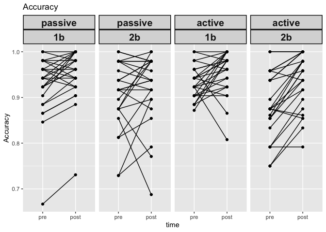<!-- -->

``` r
ggplot(subset(nback_prepost, dvtype == "rt"), aes(x = time, y = perf, group = sub)) + 
  geom_line() + 
  geom_point() +
  facet_grid(~intensity * load) +
  labs(title = "Reaction Time", y = "RT") + 
  theme(strip.text = element_text(face = "bold", size = 15, lineheight = 5.0), 
  strip.background = element_rect(colour = "black", size = 1))
```

<!-- -->

``` r
ggplot(subset(nback_percdiff,dvtype == "rt"), aes(x = intensity, y = perf, fill = load)) + 
  scale_fill_manual(values = c("#E3871C", "#F5BD78")) +
  geom_boxplot() + 
  labs(title = "Acute RT %change on N-back", y = "%Diff", x= "", fill = "load") +
  theme(title = element_text(size = 16, face = "bold"),
        axis.text.x = element_text(size = 16),
        axis.text.y = element_text(size = 15),
        axis.title.y = element_text(size = 16),
        legend.text = element_text(size = 15),
        legend.title = element_text(size = 15))
```

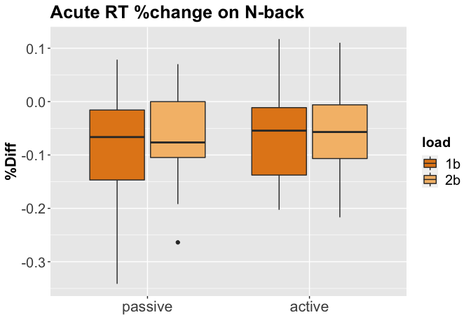<!-- -->

``` r
ggplot(subset(nback_percdiff, dvtype == "rt"), aes(x = intensity, y = perf)) + 
  stat_summary(aes(y = perf), size = .5, fun.y = mean, geom = "bar", size = 1) + 
  stat_summary(fun.data = mean_cl_normal, geom = "errorbar", size = .5, width = .3) + 
        facet_grid(~load) +
        labs(title = "Acute RT %change on N-back", y = "%Diff", x = "") +
        theme(title = element_text(size = 16, face = "bold"),
        axis.text.x = element_text(size = 16),
        axis.text.y = element_text(size = 15),
        axis.title.y = element_text(size = 16),
        legend.text = element_text(size = 15),
        legend.title = element_text(size = 15))
```

    ## Warning: `fun.y` is deprecated. Use `fun` instead.

    ## Warning: Duplicated aesthetics after name standardisation: size

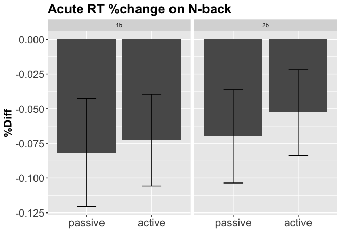<!-- -->

``` r
ggplot(subset(nback_percdiff, dvtype == "rt"), aes(x = load,y = perf)) + 
  stat_summary(aes(y = perf), size = .5, fun.y = mean, geom = "bar", size = 1) + 
  stat_summary(fun.data = mean_cl_normal, geom = "errorbar", size = .5, width = .3) + 
        facet_grid(~intensity) +
        labs(title = "Acute RT %change on N-back", y = "%Diff", x= "") +
        theme(title = element_text(size = 16, face = "bold"),
        axis.text.x = element_text(size = 16),
        axis.text.y = element_text(size = 15),
        axis.title.y = element_text(size = 16),
        legend.text = element_text(size = 15),
        legend.title = element_text(size = 15))
```

    ## Warning: `fun.y` is deprecated. Use `fun` instead.
    
    ## Warning: Duplicated aesthetics after name standardisation: size

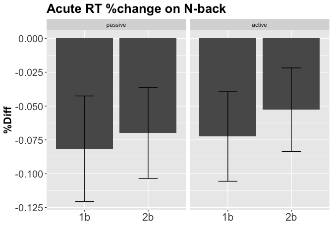<!-- -->

``` r
ggplot(subset(nback_percdiff,dvtype=="acc"), aes(x=intensity,y=perf,fill=load)) + 
  scale_fill_manual(values=c("#E3871C", "#F5BD78")) +
  geom_boxplot() + 
  labs(title="Acute ACC %change on N-back",y="%Diff",x="",fill="load") +
  theme(title=element_text(size=16, face='bold'),
        axis.text.x = element_text(size=16),
        axis.text.y = element_text(size=15),
        axis.title.y = element_text(size=16),
        legend.text = element_text(size=15),
        legend.title = element_text(size=15))
```

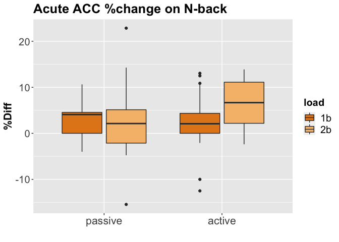<!-- -->

``` r
ggplot(subset(nback_percdiff,dvtype=="acc"), aes(x=intensity,y=perf)) + 
  stat_summary(aes(y = perf), size=.5, fun.y = mean, geom="bar",size=1) + 
  stat_summary(fun.data=mean_cl_normal, geom="errorbar", size=.5,width=.3) + 
        facet_grid(~load) +
        labs(title="Acute ACC %change on N-back",y="%Diff",x="") +
        theme(title=element_text(size=16, face='bold'),
        axis.text.x = element_text(size=16),
        axis.text.y = element_text(size=15),
        axis.title.y = element_text(size=16),
        legend.text = element_text(size=15),
        legend.title = element_text(size=15))
```

    ## Warning: `fun.y` is deprecated. Use `fun` instead.

    ## Warning: Duplicated aesthetics after name standardisation: size

<!-- -->

``` r
ggplot(subset(nback_percdiff,dvtype=="acc"), aes(x=load,y=perf)) + 
  stat_summary(aes(y = perf), size=.5, fun.y = mean, geom="bar",size=1) + 
  stat_summary(fun.data=mean_cl_normal, geom="errorbar", size=.5,width=.3) + 
        facet_grid(~intensity) +
        labs(title="Acute ACC %change on N-back",y="%Diff",x="") +
        theme(title=element_text(size=16, face='bold'),
        axis.text.x = element_text(size=16),
        axis.text.y = element_text(size=15),
        axis.title.y = element_text(size=16),
        legend.text = element_text(size=15),
        legend.title = element_text(size=15))
```

    ## Warning: `fun.y` is deprecated. Use `fun` instead.
    
    ## Warning: Duplicated aesthetics after name standardisation: size

<!-- -->

### nback stats

#### repeated measures anova with time as a factor

``` r
aovACC <- aov_car(perf ~ time * intensity * load + Error(sub / time * intensity * load), subset(nback_prepost, dvtype == "acc"))
nice(aovACC)
```

    ## Anova Table (Type 3 tests)
    ## 
    ## Response: perf
    ##                Effect    df  MSE         F    ges p.value
    ## 1                time 1, 24 0.00 28.85 ***    .05  <.0001
    ## 2           intensity 1, 24 0.00      0.00 <.0001     .96
    ## 3                load 1, 24 0.01    7.63 *    .05     .01
    ## 4      time:intensity 1, 24 0.00      2.63   .006     .12
    ## 5           time:load 1, 24 0.00      1.88   .002     .18
    ## 6      intensity:load 1, 24 0.00      1.75   .002     .20
    ## 7 time:intensity:load 1, 24 0.00      2.90   .006     .10
    ## ---
    ## Signif. codes:  0 '***' 0.001 '**' 0.01 '*' 0.05 '+' 0.1 ' ' 1

#### repeated measures anova with percentdiff

**reaction
time**

``` r
aovRT <- aov_car(perf ~ intensity * load + Error(sub / intensity * load), subset(nback_percdiff, dvtype == "rt"))
nice(aovRT)
```

    ## Anova Table (Type 3 tests)
    ## 
    ## Response: perf
    ##           Effect    df  MSE    F   ges p.value
    ## 1      intensity 1, 24 0.01 0.62  .007     .44
    ## 2           load 1, 24 0.00 1.53  .009     .23
    ## 3 intensity:load 1, 24 0.00 0.19 .0006     .66
    ## ---
    ## Signif. codes:  0 '***' 0.001 '**' 0.01 '*' 0.05 '+' 0.1 ' ' 1

``` r
aovRT_fitted <- lsmeans(aovRT, ~load|intensity)
aovRT_fitted
```

    ## intensity = passive:
    ##  load  lsmean     SE   df lower.CL upper.CL
    ##  X1b  -0.0815 0.0166 66.2  -0.1147  -0.0484
    ##  X2b  -0.0700 0.0166 66.2  -0.1031  -0.0369
    ## 
    ## intensity = active:
    ##  load  lsmean     SE   df lower.CL upper.CL
    ##  X1b  -0.0725 0.0166 66.2  -0.1056  -0.0394
    ##  X2b  -0.0527 0.0166 66.2  -0.0858  -0.0195
    ## 
    ## Warning: EMMs are biased unless design is perfectly balanced 
    ## Confidence level used: 0.95

``` r
pairs(aovRT_fitted)
```

    ## intensity = passive:
    ##  contrast  estimate     SE   df t.ratio p.value
    ##  X1b - X2b  -0.0116 0.0158 44.1 -0.733  0.4675 
    ## 
    ## intensity = active:
    ##  contrast  estimate     SE   df t.ratio p.value
    ##  X1b - X2b  -0.0198 0.0158 44.1 -1.257  0.2154

**accuracy**

``` r
aovACC <- aov_car(perf ~ intensity * load + Error(sub / intensity * load), subset(nback_percdiff, dvtype == "acc"))
nice(aovACC)
```

    ## Anova Table (Type 3 tests)
    ## 
    ## Response: perf
    ##           Effect    df   MSE      F ges p.value
    ## 1      intensity 1, 24 43.40   2.00 .02     .17
    ## 2           load 1, 24 24.99 3.32 + .02     .08
    ## 3 intensity:load 1, 24 38.94   2.59 .03     .12
    ## ---
    ## Signif. codes:  0 '***' 0.001 '**' 0.01 '*' 0.05 '+' 0.1 ' ' 1

``` r
aovACC_fitted <- lsmeans(aovACC, ~load|intensity)
aovACC_fitted
```

    ## intensity = passive:
    ##  load lsmean  SE   df lower.CL upper.CL
    ##  X1b    2.71 1.2 92.7    0.333     5.09
    ##  X2b    2.52 1.2 92.7    0.146     4.90
    ## 
    ## intensity = active:
    ##  load lsmean  SE   df lower.CL upper.CL
    ##  X1b    2.57 1.2 92.7    0.187     4.94
    ##  X2b    6.40 1.2 92.7    4.018     8.78
    ## 
    ## Warning: EMMs are biased unless design is perfectly balanced 
    ## Confidence level used: 0.95

``` r
pairs(aovACC_fitted)
```

    ## intensity = passive:
    ##  contrast  estimate  SE   df t.ratio p.value
    ##  X1b - X2b    0.187 1.6 45.8  0.117  0.9073 
    ## 
    ## intensity = active:
    ##  contrast  estimate  SE   df t.ratio p.value
    ##  X1b - X2b   -3.832 1.6 45.8 -2.396  0.0207

**Accuracy with glm and covariates **

Set to effect coding

``` r
contrasts(nback_prepost$time) <- c(-.5, .5)
contrasts(nback_prepost$time)
```

    ##      [,1]
    ## pre  -0.5
    ## post  0.5

``` r
contrasts(nback_prepost$intensity) <- c(-.5, .5)
contrasts(nback_prepost$intensity)
```

    ##         [,1]
    ## passive -0.5
    ## active   0.5

``` r
contrasts(nback_prepost$load) <- c(-.5, .5)
contrasts(nback_prepost$load)
```

    ##    [,1]
    ## 1b -0.5
    ## 2b  0.5

``` r
lm_acc <- lmer(perf ~ time * intensity * load + (1 + time + intensity + load | sub), data = subset(nback_prepost, dvtype == "acc"))
```

    ## boundary (singular) fit: see ?isSingular

``` r
lm_acc2<-lmer(perf ~ time * intensity * load + (1 | sub), data = subset(nback_prepost, dvtype == "acc"))
anova(lm_acc, lm_acc2)
```

    ## refitting model(s) with ML (instead of REML)

    ## Data: subset(nback_prepost, dvtype == "acc")
    ## Models:
    ## lm_acc2: perf ~ time * intensity * load + (1 | sub)
    ## lm_acc: perf ~ time * intensity * load + (1 + time + intensity + load | 
    ## lm_acc:     sub)
    ##         Df     AIC     BIC logLik deviance  Chisq Chi Df Pr(>Chisq)    
    ## lm_acc2 10 -592.69 -559.70 306.34  -612.69                             
    ## lm_acc  19 -630.62 -567.95 334.31  -668.62 55.931      9   8.09e-09 ***
    ## ---
    ## Signif. codes:  0 '***' 0.001 '**' 0.01 '*' 0.05 '.' 0.1 ' ' 1

``` r
summary(lm_acc)
```

    ## Linear mixed model fit by REML. t-tests use Satterthwaite's method [
    ## lmerModLmerTest]
    ## Formula: perf ~ time * intensity * load + (1 + time + intensity + load |  
    ##     sub)
    ##    Data: subset(nback_prepost, dvtype == "acc")
    ## 
    ## REML criterion at convergence: -608.3
    ## 
    ## Scaled residuals: 
    ##      Min       1Q   Median       3Q      Max 
    ## -2.67929 -0.49514 -0.02656  0.64642  1.83805 
    ## 
    ## Random effects:
    ##  Groups   Name        Variance  Std.Dev. Corr             
    ##  sub      (Intercept) 0.0019385 0.04403                   
    ##           time1       0.0003483 0.01866   0.34            
    ##           intensity1  0.0010106 0.03179  -0.57 -0.82      
    ##           load1       0.0021779 0.04667   0.44 -0.68  0.29
    ##  Residual             0.0011996 0.03463                   
    ## Number of obs: 200, groups:  sub, 25
    ## 
    ## Fixed effects:
    ##                          Estimate Std. Error         df t value Pr(>|t|)
    ## (Intercept)             9.263e-01  9.140e-03  2.422e+01 101.345  < 2e-16
    ## time1                   2.904e-02  6.158e-03  3.347e+01   4.715 4.13e-05
    ## intensity1              4.274e-04  8.026e-03  2.415e+01   0.053   0.9580
    ## load1                  -2.896e-02  1.054e-02  2.418e+01  -2.748   0.0112
    ## time1:intensity1        1.891e-02  9.796e-03  1.198e+02   1.930   0.0559
    ## time1:load1             1.192e-02  9.796e-03  1.198e+02   1.217   0.2260
    ## intensity1:load1       -1.197e-02  9.796e-03  1.198e+02  -1.221   0.2243
    ## time1:intensity1:load1  3.885e-02  1.959e-02  1.198e+02   1.983   0.0497
    ##                           
    ## (Intercept)            ***
    ## time1                  ***
    ## intensity1                
    ## load1                  *  
    ## time1:intensity1       .  
    ## time1:load1               
    ## intensity1:load1          
    ## time1:intensity1:load1 *  
    ## ---
    ## Signif. codes:  0 '***' 0.001 '**' 0.01 '*' 0.05 '.' 0.1 ' ' 1
    ## 
    ## Correlation of Fixed Effects:
    ##             (Intr) time1  intns1 load1  tm1:n1 tm1:l1 int1:1
    ## time1        0.201                                          
    ## intensity1  -0.435 -0.395                                   
    ## load1        0.379 -0.366  0.205                            
    ## tm1:ntnsty1  0.000  0.000  0.000  0.000                     
    ## time1:load1  0.000  0.000  0.000  0.000  0.000              
    ## intnsty1:l1  0.000  0.000  0.000  0.000  0.000  0.000       
    ## tm1:ntns1:1  0.000  0.000  0.000  0.000  0.000  0.000  0.000
    ## convergence code: 0
    ## boundary (singular) fit: see ?isSingular

``` r
cat_plot(lm_acc, pred = time, modx = intensity, mod2 = load, geom = "line")
```

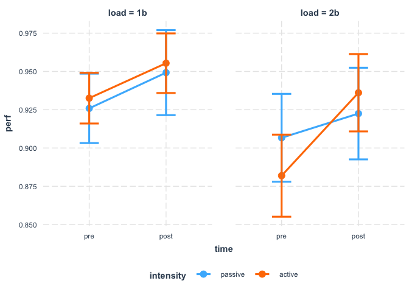<!-- -->

``` r
exercise_data <- subset(exercise_data, exclude == "include")

jmv::anovaRM(
    data = data,
    rm = list(
        list(
            label="intensity",
            levels=c("passive", "active")),
        list(
            label="load",
            levels=c("1back", "2back")),
        list(
            label="time",
            levels=c("pre", "post"))),
    rmCells = list(
        list(
            measure="pre_passive_1b_acc",
            cell=c("passive", "1back", "pre")),
        list(
            measure="post_passive_1b_acc",
            cell=c("passive", "1back", "post")),
        list(
            measure="pre_passive_2b_acc",
            cell=c("passive", "2back", "pre")),
        list(
            measure="post_passive_2b_acc",
            cell=c("passive", "2back", "post")),
        list(
            measure="pre_active_1b_acc",
            cell=c("active", "1back", "pre")),
        list(
            measure="post_active_1b_acc",
            cell=c("active", "1back", "post")),
        list(
            measure="pre_active_2b_acc",
            cell=c("active", "2back", "pre")),
        list(
            measure="post_active_2b_acc",
            cell=c("active", "2back", "post"))),
    effectSize = "partEta",
    rmTerms = ~ intensity + load + time + intensity:load + intensity:time + load:time + intensity:load:time)
```

    ## 
    ##  REPEATED MEASURES ANOVA
    ## 
    ##  Within Subjects Effects                                                                       
    ##  ───────────────────────────────────────────────────────────────────────────────────────────── 
    ##                           Sum of Squares    df    Mean Square    F           p         η²-p    
    ##  ───────────────────────────────────────────────────────────────────────────────────────────── 
    ##    intensity                     9.13e-6     1        9.13e-6     0.00283     0.958    0.000   
    ##    Residual                      0.07749    24        0.00323                                  
    ##    load                          0.04194     1        0.04194     7.62810     0.011    0.241   
    ##    Residual                      0.13197    24        0.00550                                  
    ##    time                          0.04216     1        0.04216    28.85475    < .001    0.546   
    ##    Residual                      0.03507    24        0.00146                                  
    ##    intensity:load                0.00179     1        0.00179     1.75068     0.198    0.068   
    ##    Residual                      0.02454    24        0.00102                                  
    ##    intensity:time                0.00447     1        0.00447     2.63166     0.118    0.099   
    ##    Residual                      0.04076    24        0.00170                                  
    ##    load:time                     0.00178     1        0.00178     1.88048     0.183    0.073   
    ##    Residual                      0.02268    24        9.45e-4                                  
    ##    intensity:load:time           0.00472     1        0.00472     2.89659     0.102    0.108   
    ##    Residual                      0.03907    24        0.00163                                  
    ##  ───────────────────────────────────────────────────────────────────────────────────────────── 
    ##    Note. Type 3 Sums of Squares
    ## 
    ## 
    ##  Between Subjects Effects                                                   
    ##  ────────────────────────────────────────────────────────────────────────── 
    ##                Sum of Squares    df    Mean Square    F    p        η²-p    
    ##  ────────────────────────────────────────────────────────────────────────── 
    ##    Residual             0.403    24         0.0168                          
    ##  ────────────────────────────────────────────────────────────────────────── 
    ##    Note. Type 3 Sums of Squares

## flanker

``` r
flanker_prepost <- data %>%
        filter(exclude=="include") %>%
        select(sub,countergroup,pre_passive_inc_acc:percdiff_passive_con_rt) %>%
        select(sub,countergroup,matches("pre|post")) %>%
        gather(key=condition,value=perf,-sub,-countergroup)

# now split condition column up to it's factors
flanker_prepost <- separate(flanker_prepost, "condition", c("time", "intensity", "load", "dvtype"), "_")

write.csv(flanker_prepost, "acute_flanker-prepost_weng-etal-2015.csv", row.names=FALSE)
```

``` r
flanker_percdiff <- data %>%
        filter(exclude=="include") %>%
        select(sub,countergroup,pre_passive_inc_acc:percdiff_passive_con_rt) %>%
        select(sub,countergroup,matches("percdiff")) %>%
        gather(key=condition,value=perf,-sub,-countergroup)

# now split condition column up to it's factors
flanker_percdiff <- separate(flanker_percdiff, "condition", c("drop", "intensity", "load", "dvtype"), "_")
flanker_percdiff$drop <- NULL

write.csv(flanker_percdiff,"acute_flanker-percdiff_weng-etal-2015.csv",row.names=FALSE)
```

### set factors

``` r
flanker_prepost$time <- as.factor(flanker_prepost$time)
flanker_prepost$time <- relevel(flanker_prepost$time,"pre")
flanker_prepost$intensity <- as.factor(flanker_prepost$intensity)
flanker_prepost$intensity <- relevel(flanker_prepost$intensity,"passive")
flanker_prepost$load <- as.factor(flanker_prepost$load)

flanker_percdiff$intensity <- as.factor(flanker_percdiff$intensity)
flanker_percdiff$intensity <- relevel(flanker_percdiff$intensity,"passive")
flanker_percdiff$load <- as.factor(flanker_percdiff$load)
```

### plot flanker

``` r
ggplot(subset(flanker_prepost,dvtype=="acc"), aes(x=time,y=perf,group=sub)) + 
  geom_line() + 
  geom_point() +
        facet_grid(~intensity*load) +
        labs(title="Accuracy",y="Accuracy") + 
        theme(strip.text = element_text(face="bold", size=15,lineheight=5.0), 
        strip.background = element_rect(colour="black", size=1))
```

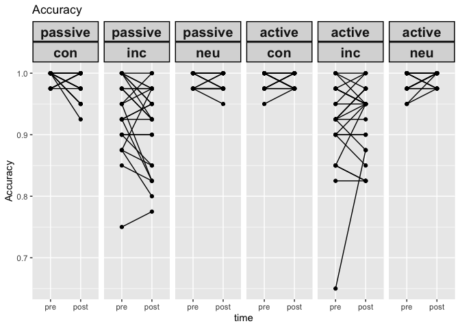<!-- -->

``` r
ggplot(subset(flanker_prepost,dvtype=="rt"), aes(x=time,y=perf,group=sub)) + 
  geom_line() + 
  geom_point() +
        facet_grid(~intensity*load) +
        labs(title="Reaction Time",y="RT") + 
        theme(strip.text = element_text(face="bold", size=15,lineheight=5.0), 
        strip.background = element_rect(colour="black", size=1))
```

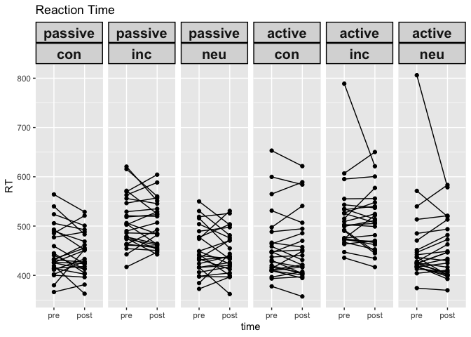<!-- -->

``` r
ggplot(subset(flanker_percdiff,dvtype=="rt"), aes(x=intensity,y=perf,fill=load)) + 
  scale_fill_manual(values=c("#E3871C", "#F5BD78","#CC9966")) +
  geom_boxplot() + 
  labs(title="Acute RT %change on flanker",y="%Diff",x="",fill="load") +
  theme(title=element_text(size=16, face='bold'),
        axis.text.x = element_text(size=16),
        axis.text.y = element_text(size=15),
        axis.title.y = element_text(size=16),
        legend.text = element_text(size=15),
        legend.title = element_text(size=15))
```

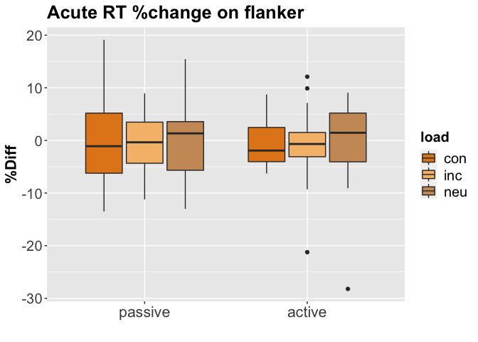<!-- -->

``` r
ggplot(subset(flanker_percdiff,dvtype=="rt"), aes(x=intensity,y=perf)) + 
  stat_summary(aes(y = perf), size=.5, fun.y = mean, geom="bar",size=1) + 
  stat_summary(fun.data=mean_cl_normal, geom="errorbar", size=.5,width=.3) + 
        facet_grid(~load) +
        labs(title="Acute RT %change on flanker",y="%Diff",x="") +
        theme(title=element_text(size=16, face='bold'),
        axis.text.x = element_text(size=16),
        axis.text.y = element_text(size=15),
        axis.title.y = element_text(size=16),
        legend.text = element_text(size=15),
        legend.title = element_text(size=15))
```

    ## Warning: `fun.y` is deprecated. Use `fun` instead.

    ## Warning: Duplicated aesthetics after name standardisation: size

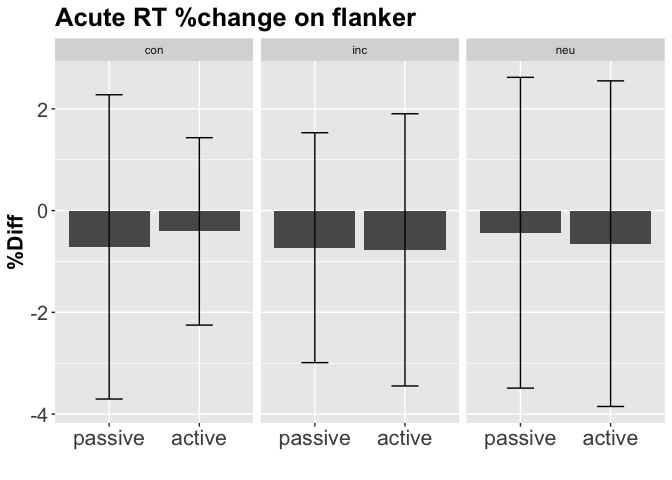<!-- -->

``` r
ggplot(subset(flanker_percdiff,dvtype=="rt"), aes(x=load,y=perf)) + 
  stat_summary(aes(y = perf), size=.5, fun.y = mean, geom="bar",size=1) + 
  stat_summary(fun.data=mean_cl_normal, geom="errorbar", size=.5,width=.3) + 
        facet_grid(~intensity) +
        labs(title="Acute RT %change on flanker",y="%Diff",x="") +
        theme(title=element_text(size=16, face='bold'),
        axis.text.x = element_text(size=16),
        axis.text.y = element_text(size=15),
        axis.title.y = element_text(size=16),
        legend.text = element_text(size=15),
        legend.title = element_text(size=15))
```

    ## Warning: `fun.y` is deprecated. Use `fun` instead.
    
    ## Warning: Duplicated aesthetics after name standardisation: size

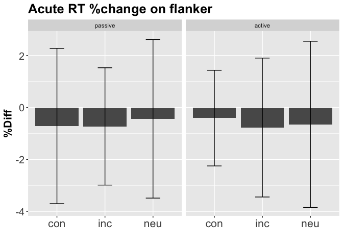<!-- -->

``` r
ggplot(subset(flanker_percdiff,dvtype=="acc"), aes(x=intensity,y=perf,fill=load)) + 
  scale_fill_manual(values=c("#E3871C", "#F5BD78","#CC9966")) +
  geom_boxplot() + 
  labs(title="Acute ACC %change on flanker",y="%Diff",x="",fill="load") +
  theme(title=element_text(size=16, face='bold'),
        axis.text.x = element_text(size=16),
        axis.text.y = element_text(size=15),
        axis.title.y = element_text(size=16),
        legend.text = element_text(size=15),
        legend.title = element_text(size=15))
```

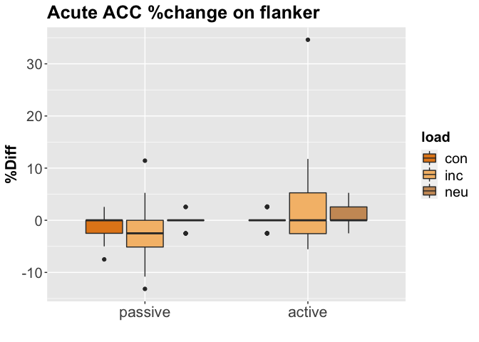<!-- -->

``` r
ggplot(subset(flanker_percdiff,dvtype=="acc"), aes(x=intensity,y=perf)) + 
  stat_summary(aes(y = perf), size=.5, fun.y = mean, geom="bar",size=1) + 
  stat_summary(fun.data=mean_cl_normal, geom="errorbar", size=.5,width=.3) + 
        facet_grid(~load) +
        labs(title="Acute ACC %change on flanker",y="%Diff",x="") +
        theme(title=element_text(size=16, face='bold'),
        axis.text.x = element_text(size=16),
        axis.text.y = element_text(size=15),
        axis.title.y = element_text(size=16),
        legend.text = element_text(size=15),
        legend.title = element_text(size=15))
```

    ## Warning: `fun.y` is deprecated. Use `fun` instead.

    ## Warning: Duplicated aesthetics after name standardisation: size

<!-- -->

``` r
ggplot(subset(flanker_percdiff,dvtype=="acc"), aes(x=load,y=perf)) + 
  stat_summary(aes(y = perf), size=.5, fun.y = mean, geom="bar",size=1) + 
  stat_summary(fun.data=mean_cl_normal, geom="errorbar", size=.5,width=.3) + 
        facet_grid(~intensity) +
        labs(title="Acute ACC %change on flanker",y="%Diff",x="") +
        theme(title=element_text(size=16, face='bold'),
        axis.text.x = element_text(size=16),
        axis.text.y = element_text(size=15),
        axis.title.y = element_text(size=16),
        legend.text = element_text(size=15),
        legend.title = element_text(size=15))
```

    ## Warning: `fun.y` is deprecated. Use `fun` instead.
    
    ## Warning: Duplicated aesthetics after name standardisation: size

<!-- -->

#### repeated measures anova with time as a factor

``` r
aovACC<-aov_car(perf~time*intensity*load+Error(sub/time*intensity*load),subset(flanker_prepost,dvtype=="acc"))
nice(aovACC)
```

    ## Anova Table (Type 3 tests)
    ## 
    ## Response: perf
    ##                Effect          df  MSE         F    ges p.value
    ## 1                time       1, 24 0.00      0.69  .0009     .42
    ## 2           intensity       1, 24 0.00      0.01 <.0001     .93
    ## 3                load 1.03, 24.61 0.01 40.47 ***    .40  <.0001
    ## 4      time:intensity       1, 24 0.00    5.81 *   .010     .02
    ## 5           time:load 1.21, 29.00 0.00      0.55   .001     .49
    ## 6      intensity:load 1.22, 29.38 0.00      0.06  .0002     .85
    ## 7 time:intensity:load 1.39, 33.40 0.00      1.86   .005     .18
    ## ---
    ## Signif. codes:  0 '***' 0.001 '**' 0.01 '*' 0.05 '+' 0.1 ' ' 1
    ## 
    ## Sphericity correction method: GG

#### repeated measures anova with percentdiff

**reaction
time**

``` r
aovRT<-aov_car(perf~intensity*load+Error(sub/intensity*load),subset(flanker_percdiff,dvtype=="rt"))
nice(aovRT)
```

    ## Anova Table (Type 3 tests)
    ## 
    ## Response: perf
    ##           Effect          df   MSE    F    ges p.value
    ## 1      intensity       1, 24 66.45 0.00 <.0001     .99
    ## 2           load 1.95, 46.78 15.46 0.04  .0002     .95
    ## 3 intensity:load 1.94, 46.64 16.08 0.06  .0003     .94
    ## ---
    ## Signif. codes:  0 '***' 0.001 '**' 0.01 '*' 0.05 '+' 0.1 ' ' 1
    ## 
    ## Sphericity correction method: GG

``` r
aovRT_fitted<-lsmeans(aovRT,~load|intensity)
aovRT_fitted
```

    ## intensity = passive:
    ##  load lsmean   SE   df lower.CL upper.CL
    ##  con  -0.713 1.31 71.3    -3.33     1.91
    ##  inc  -0.729 1.31 71.3    -3.35     1.89
    ##  neu  -0.435 1.31 71.3    -3.06     2.19
    ## 
    ## intensity = active:
    ##  load lsmean   SE   df lower.CL upper.CL
    ##  con  -0.409 1.31 71.3    -3.03     2.21
    ##  inc  -0.772 1.31 71.3    -3.39     1.85
    ##  neu  -0.650 1.31 71.3    -3.27     1.97
    ## 
    ## Warning: EMMs are biased unless design is perfectly balanced 
    ## Confidence level used: 0.95

``` r
pairs(aovRT_fitted)
```

    ## intensity = passive:
    ##  contrast  estimate   SE df t.ratio p.value
    ##  con - inc   0.0155 1.11 96  0.014  0.9999 
    ##  con - neu  -0.2785 1.11 96 -0.251  0.9658 
    ##  inc - neu  -0.2941 1.11 96 -0.265  0.9619 
    ## 
    ## intensity = active:
    ##  contrast  estimate   SE df t.ratio p.value
    ##  con - inc   0.3629 1.11 96  0.328  0.9426 
    ##  con - neu   0.2411 1.11 96  0.218  0.9742 
    ##  inc - neu  -0.1218 1.11 96 -0.110  0.9934 
    ## 
    ## P value adjustment: tukey method for comparing a family of 3 estimates

**accuracy**

``` r
aovACC<-aov_car(perf~intensity*load+Error(sub/intensity*load),subset(flanker_percdiff,dvtype=="acc"))
nice(aovACC)
```

    ## Anova Table (Type 3 tests)
    ## 
    ## Response: perf
    ##           Effect          df   MSE      F  ges p.value
    ## 1      intensity       1, 24 23.20 4.93 *  .04     .04
    ## 2           load 1.15, 27.63 25.14   0.37 .004     .58
    ## 3 intensity:load 1.26, 30.25 30.17   1.90  .03     .18
    ## ---
    ## Signif. codes:  0 '***' 0.001 '**' 0.01 '*' 0.05 '+' 0.1 ' ' 1
    ## 
    ## Sphericity correction method: GG

``` r
aovACC_fitted<-lsmeans(aovACC,~load|intensity)
aovACC_fitted
```

    ## intensity = passive:
    ##  load  lsmean    SE  df lower.CL upper.CL
    ##  con  -0.8897 0.847 140  -2.5644    0.785
    ##  inc  -1.9435 0.847 140  -3.6182   -0.269
    ##  neu  -0.1974 0.847 140  -1.8721    1.477
    ## 
    ## intensity = active:
    ##  load  lsmean    SE  df lower.CL upper.CL
    ##  con  -0.0845 0.847 140  -1.7592    1.590
    ##  inc   1.7633 0.847 140   0.0886    3.438
    ##  neu   0.5286 0.847 140  -1.1461    2.203
    ## 
    ## Warning: EMMs are biased unless design is perfectly balanced 
    ## Confidence level used: 0.95

``` r
pairs(aovACC_fitted)
```

    ## intensity = passive:
    ##  contrast  estimate   SE   df t.ratio p.value
    ##  con - inc    1.054 1.16 94.3  0.911  0.6350 
    ##  con - neu   -0.692 1.16 94.3 -0.598  0.8214 
    ##  inc - neu   -1.746 1.16 94.3 -1.509  0.2914 
    ## 
    ## intensity = active:
    ##  contrast  estimate   SE   df t.ratio p.value
    ##  con - inc   -1.848 1.16 94.3 -1.597  0.2521 
    ##  con - neu   -0.613 1.16 94.3 -0.530  0.8569 
    ##  inc - neu    1.235 1.16 94.3  1.067  0.5369 
    ## 
    ## P value adjustment: tukey method for comparing a family of 3 estimates

**Accuracy with glm and covariates **

Set to effect coding

``` r
contrasts(flanker_prepost$time) <- c(-.5,.5)
contrasts(flanker_prepost$time)
```

    ##      [,1]
    ## pre  -0.5
    ## post  0.5

``` r
contrasts(flanker_prepost$intensity) <- c(-.5,.5)
contrasts(flanker_prepost$intensity)
```

    ##         [,1]
    ## passive -0.5
    ## active   0.5

``` r
flanker_prepost$load <- relevel(flanker_prepost$load,"neu")
# not sure if effect coding for 3-level variable is correct here
c<-contr.treatment(3)
my.coding<-matrix(rep(.25, 6), ncol=2)
my.simple<-c-my.coding
my.simple[my.simple==.75]<-.50
contrasts(flanker_prepost$load)<-my.simple
contrasts(flanker_prepost$load)
```

    ##         2     3
    ## neu -0.25 -0.25
    ## con  0.50 -0.25
    ## inc -0.25  0.50

``` r
lm_acc<-lmer(perf ~ time*intensity*load + (1 + time + intensity + load |sub), data=subset(flanker_prepost,dvtype=="acc"))
```

    ## boundary (singular) fit: see ?isSingular

``` r
lm_acc2<-lmer(perf ~ time*intensity*load + (1 |sub), data=subset(flanker_prepost,dvtype=="acc"))
anova(lm_acc,lm_acc2)
```

    ## refitting model(s) with ML (instead of REML)

    ## Data: subset(flanker_prepost, dvtype == "acc")
    ## Models:
    ## lm_acc2: perf ~ time * intensity * load + (1 | sub)
    ## lm_acc: perf ~ time * intensity * load + (1 + time + intensity + load | 
    ## lm_acc:     sub)
    ##         Df     AIC     BIC logLik deviance  Chisq Chi Df Pr(>Chisq)    
    ## lm_acc2 14 -1114.8 -1062.9 571.37  -1142.8                             
    ## lm_acc  28 -1278.7 -1175.0 667.36  -1334.7 191.97     14  < 2.2e-16 ***
    ## ---
    ## Signif. codes:  0 '***' 0.001 '**' 0.01 '*' 0.05 '.' 0.1 ' ' 1

``` r
summary(lm_acc)
```

    ## Linear mixed model fit by REML. t-tests use Satterthwaite's method [
    ## lmerModLmerTest]
    ## Formula: perf ~ time * intensity * load + (1 + time + intensity + load |  
    ##     sub)
    ##    Data: subset(flanker_prepost, dvtype == "acc")
    ## 
    ## REML criterion at convergence: -1235.6
    ## 
    ## Scaled residuals: 
    ##     Min      1Q  Median      3Q     Max 
    ## -5.6729 -0.5944  0.1966  0.4473  3.2362 
    ## 
    ## Random effects:
    ##  Groups   Name        Variance  Std.Dev. Corr                   
    ##  sub      (Intercept) 4.170e-04 0.020420                        
    ##           time1       3.096e-05 0.005564  0.00                  
    ##           intensity1  1.378e-04 0.011737  0.14 -0.76            
    ##           load2       2.192e-06 0.001480  0.58  0.18  0.45      
    ##           load3       4.617e-03 0.067950  1.00  0.03  0.11  0.58
    ##  Residual             5.155e-04 0.022705                        
    ## Number of obs: 300, groups:  sub, 25
    ## 
    ## Fixed effects:
    ##                          Estimate Std. Error         df t value Pr(>|t|)
    ## (Intercept)             9.692e-01  4.289e-03  2.396e+01 225.956  < 2e-16
    ## time1                  -2.333e-03  2.848e-03  2.470e+01  -0.819  0.42048
    ## intensity1             -3.333e-04  3.519e-03  2.415e+01  -0.095  0.92532
    ## load2                  -1.000e-03  4.292e-03  2.114e+02  -0.233  0.81597
    ## load3                  -8.933e-02  1.425e-02  2.394e+01  -6.270 1.78e-06
    ## time1:intensity1        1.533e-02  5.243e-03  2.151e+02   2.924  0.00382
    ## time1:load2            -8.667e-03  8.563e-03  2.151e+02  -1.012  0.31260
    ## time1:load3            -6.667e-03  8.563e-03  2.151e+02  -0.779  0.43708
    ## intensity1:load2        2.000e-03  8.563e-03  2.151e+02   0.234  0.81554
    ## intensity1:load3       -1.333e-03  8.563e-03  2.151e+02  -0.156  0.87640
    ## time1:intensity1:load2  1.333e-03  1.713e-02  2.151e+02   0.078  0.93801
    ## time1:intensity1:load3  3.200e-02  1.713e-02  2.151e+02   1.869  0.06304
    ##                           
    ## (Intercept)            ***
    ## time1                     
    ## intensity1                
    ## load2                     
    ## load3                  ***
    ## time1:intensity1       ** 
    ## time1:load2               
    ## time1:load3               
    ## intensity1:load2          
    ## intensity1:load3          
    ## time1:intensity1:load2    
    ## time1:intensity1:load3 .  
    ## ---
    ## Signif. codes:  0 '***' 0.001 '**' 0.01 '*' 0.05 '.' 0.1 ' ' 1
    ## 
    ## Correlation of Fixed Effects:
    ##             (Intr) time1  intns1 load2  load3  tm1:n1 tm1:l2 tm1:l3 int1:2
    ## time1       -0.002                                                        
    ## intensity1   0.090 -0.199                                                 
    ## load2        0.038  0.005  0.021                                          
    ## load3        0.908  0.012  0.071  0.188                                   
    ## tm1:ntnsty1  0.000  0.000  0.000  0.000  0.000                            
    ## time1:load2  0.000  0.000  0.000  0.000  0.000  0.000                     
    ## time1:load3  0.000  0.000  0.000  0.000  0.000  0.000  0.500              
    ## intnsty1:l2  0.000  0.000  0.000  0.000  0.000  0.000  0.000  0.000       
    ## intnsty1:l3  0.000  0.000  0.000  0.000  0.000  0.000  0.000  0.000  0.500
    ## tm1:ntns1:2  0.000  0.000  0.000  0.000  0.000  0.000  0.000  0.000  0.000
    ## tm1:ntns1:3  0.000  0.000  0.000  0.000  0.000  0.000  0.000  0.000  0.000
    ##             int1:3 t1:1:2
    ## time1                    
    ## intensity1               
    ## load2                    
    ## load3                    
    ## tm1:ntnsty1              
    ## time1:load2              
    ## time1:load3              
    ## intnsty1:l2              
    ## intnsty1:l3              
    ## tm1:ntns1:2  0.000       
    ## tm1:ntns1:3  0.000  0.500
    ## convergence code: 0
    ## boundary (singular) fit: see ?isSingular

``` r
cat_plot(lm_acc, pred = time, modx = intensity, mod2 = load, geom="line")
```

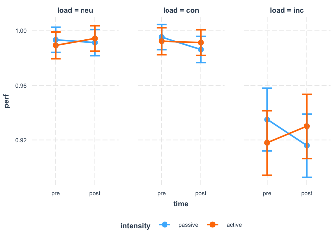<!-- -->

``` r
lm_rt<-lmer(perf ~ time*intensity*load + (1 + time + intensity + load |sub), data=subset(flanker_prepost,dvtype=="rt"))
```

    ## Warning in checkConv(attr(opt, "derivs"), opt$par, ctrl =
    ## control$checkConv, : Model failed to converge with max|grad| = 0.0175324
    ## (tol = 0.002, component 1)

``` r
lm_rt2<-lmer(perf ~ time*intensity*load + (1 |sub), data=subset(flanker_prepost,dvtype=="rt"))
anova(lm_rt,lm_rt2)
```

    ## refitting model(s) with ML (instead of REML)

    ## Data: subset(flanker_prepost, dvtype == "rt")
    ## Models:
    ## lm_rt2: perf ~ time * intensity * load + (1 | sub)
    ## lm_rt: perf ~ time * intensity * load + (1 + time + intensity + load | 
    ## lm_rt:     sub)
    ##        Df    AIC    BIC  logLik deviance  Chisq Chi Df Pr(>Chisq)    
    ## lm_rt2 14 3067.3 3119.1 -1519.6   3039.3                             
    ## lm_rt  28 2854.2 2957.9 -1399.1   2798.2 241.03     14  < 2.2e-16 ***
    ## ---
    ## Signif. codes:  0 '***' 0.001 '**' 0.01 '*' 0.05 '.' 0.1 ' ' 1

``` r
summary(lm_rt)
```

    ## Linear mixed model fit by REML. t-tests use Satterthwaite's method [
    ## lmerModLmerTest]
    ## Formula: perf ~ time * intensity * load + (1 + time + intensity + load |  
    ##     sub)
    ##    Data: subset(flanker_prepost, dvtype == "rt")
    ## 
    ## REML criterion at convergence: 2732.1
    ## 
    ## Scaled residuals: 
    ##     Min      1Q  Median      3Q     Max 
    ## -2.7621 -0.4763 -0.0363  0.5078  5.0187 
    ## 
    ## Random effects:
    ##  Groups   Name        Variance Std.Dev. Corr                   
    ##  sub      (Intercept) 2366.12  48.643                          
    ##           time1        529.59  23.013   -0.28                  
    ##           intensity1  2435.07  49.346    0.47 -0.76            
    ##           load2         79.64   8.924    0.26  0.57 -0.69      
    ##           load3        344.66  18.565   -0.17  0.40 -0.71  0.42
    ##  Residual              315.56  17.764                          
    ## Number of obs: 300, groups:  sub, 25
    ## 
    ## Fixed effects:
    ##                        Estimate Std. Error       df t value Pr(>|t|)    
    ## (Intercept)            470.4523     9.7825  23.9752  48.091  < 2e-16 ***
    ## time1                   -4.6486     5.0389  24.0420  -0.923    0.365    
    ## intensity1               7.6792    10.0802  24.0188   0.762    0.454    
    ## load2                   -0.3496     3.7954  50.1381  -0.092    0.927    
    ## load3                   78.1002     5.0006  26.6605  15.618 6.16e-15 ***
    ## time1:intensity1        -0.4437     4.1024 192.0076  -0.108    0.914    
    ## time1:load2              2.2431     6.6992 192.0076   0.335    0.738    
    ## time1:load3             -0.2260     6.6992 192.0076  -0.034    0.973    
    ## intensity1:load2         5.7943     6.6992 192.0076   0.865    0.388    
    ## intensity1:load3         2.3914     6.6992 192.0076   0.357    0.722    
    ## time1:intensity1:load2   8.2715    13.3984 192.0076   0.617    0.538    
    ## time1:intensity1:load3   3.3200    13.3984 192.0076   0.248    0.805    
    ## ---
    ## Signif. codes:  0 '***' 0.001 '**' 0.01 '*' 0.05 '.' 0.1 ' ' 1
    ## 
    ## Correlation of Fixed Effects:
    ##             (Intr) time1  intns1 load2  load3  tm1:n1 tm1:l2 tm1:l3 int1:2
    ## time1       -0.258                                                        
    ## intensity1   0.457 -0.676                                                 
    ## load2        0.120  0.245 -0.319                                          
    ## load3       -0.129  0.274 -0.514  0.443                                   
    ## tm1:ntnsty1  0.000  0.000  0.000  0.000  0.000                            
    ## time1:load2  0.000  0.000  0.000  0.000  0.000  0.000                     
    ## time1:load3  0.000  0.000  0.000  0.000  0.000  0.000  0.500              
    ## intnsty1:l2  0.000  0.000  0.000  0.000  0.000  0.000  0.000  0.000       
    ## intnsty1:l3  0.000  0.000  0.000  0.000  0.000  0.000  0.000  0.000  0.500
    ## tm1:ntns1:2  0.000  0.000  0.000  0.000  0.000  0.000  0.000  0.000  0.000
    ## tm1:ntns1:3  0.000  0.000  0.000  0.000  0.000  0.000  0.000  0.000  0.000
    ##             int1:3 t1:1:2
    ## time1                    
    ## intensity1               
    ## load2                    
    ## load3                    
    ## tm1:ntnsty1              
    ## time1:load2              
    ## time1:load3              
    ## intnsty1:l2              
    ## intnsty1:l3              
    ## tm1:ntns1:2  0.000       
    ## tm1:ntns1:3  0.000  0.500
    ## convergence code: 0
    ## Model failed to converge with max|grad| = 0.0175324 (tol = 0.002, component 1)

``` r
cat_plot(lm_rt, pred = time, modx = intensity, mod2 = load, geom="line")
```

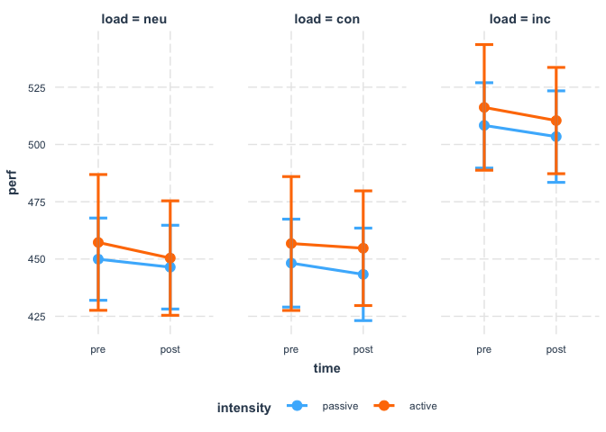<!-- -->
