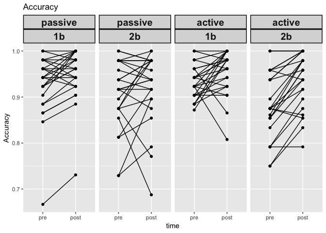
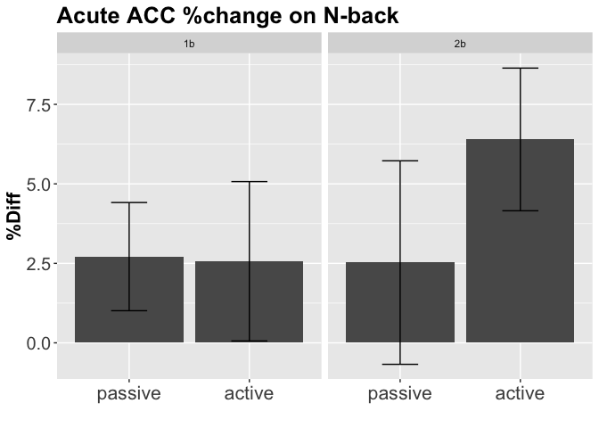

R Notebook - data from MSSE Weng et al., 2015
================
Michelle Voss
Nov 2018

-   [Setup](#setup)
-   [demographics in Table 1](#demographics-in-table-1)
-   [paired t-tests for exercise conditions](#paired-t-tests-for-exercise-conditions)
-   [Cognitive outcomes](#cognitive-outcomes)

Setup
=====

Clear previous, load packages

Load data from an spss file
---------------------------

Do not show in knit

demographics in Table 1
=======================

``` r
demogs <- data %>% 
        select(age,gender,edu,height,weight,bmi,Godin_score) 

describe(demogs)
```

    ##             vars  n  mean    sd median trimmed   mad   min   max range
    ## age            1 26 25.23  2.85  26.00   25.32  2.97 20.00 30.00 10.00
    ## gender*        2 26  1.54  0.51   2.00    1.55  0.00  1.00  2.00  1.00
    ## edu            3 26 17.77  2.74  17.75   17.73  1.85 13.00 23.00 10.00
    ## height         4 26  1.74  0.08   1.75    1.74  0.08  1.55  1.88  0.33
    ## weight         5 26 70.88 10.10  69.40   70.51 10.96 48.53 94.35 45.81
    ## bmi            6 26 23.35  2.53  22.64   23.19  2.50 19.94 28.61  8.67
    ## Godin_score    7 25 53.26 23.23  54.00   53.17 26.69 12.00 93.00 81.00
    ##              skew kurtosis   se
    ## age         -0.28    -1.27 0.56
    ## gender*     -0.15    -2.05 0.10
    ## edu          0.04    -0.93 0.54
    ## height      -0.52    -0.57 0.02
    ## weight       0.26    -0.17 1.98
    ## bmi          0.65    -0.68 0.50
    ## Godin_score  0.04    -1.22 4.65

``` r
describeBy(demogs,group="gender")
```

    ## 
    ##  Descriptive statistics by group 
    ## group: male
    ##             vars  n  mean    sd median trimmed   mad   min   max range
    ## age            1 12 25.83  2.59  26.00   25.90  2.97 21.00 30.00  9.00
    ## gender*        2 12  1.00  0.00   1.00    1.00  0.00  1.00  1.00  0.00
    ## edu            3 12 17.96  3.12  17.00   17.85  3.71 14.00 23.00  9.00
    ## height         4 12  1.78  0.06   1.78    1.78  0.04  1.68  1.88  0.20
    ## weight         5 12 74.49  7.48  74.03   74.23  7.94 62.32 89.36 27.03
    ## bmi            6 12 23.57  2.46  22.51   23.41  0.99 20.59 28.25  7.66
    ## Godin_score    7 11 54.95 26.57  49.00   55.50 33.36 12.00 93.00 81.00
    ##              skew kurtosis   se
    ## age         -0.35    -0.88 0.75
    ## gender*       NaN      NaN 0.00
    ## edu          0.25    -1.54 0.90
    ## height       0.04    -0.73 0.02
    ## weight       0.23    -0.90 2.16
    ## bmi          0.72    -1.08 0.71
    ## Godin_score -0.04    -1.61 8.01
    ## -------------------------------------------------------- 
    ## group: female
    ##             vars  n  mean    sd median trimmed   mad   min   max range
    ## age            1 14 24.71  3.05  24.00   24.83  4.45 20.00 28.00  8.00
    ## gender*        2 14  2.00  0.00   2.00    2.00  0.00  2.00  2.00  0.00
    ## edu            3 14 17.61  2.47  18.50   17.62  1.11 13.00 22.00  9.00
    ## height         4 14  1.71  0.09   1.71    1.71  0.11  1.55  1.83  0.28
    ## weight         5 14 67.78 11.24  64.86   67.17  6.72 48.53 94.35 45.81
    ## bmi            6 14 23.16  2.66  23.15   22.97  2.28 19.94 28.61  8.67
    ## Godin_score    7 14 51.93 21.20  54.50   51.42 20.02 19.00 91.00 72.00
    ##              skew kurtosis   se
    ## age         -0.11    -1.72 0.81
    ## gender*       NaN      NaN 0.00
    ## edu         -0.43    -0.71 0.66
    ## height      -0.17    -1.40 0.02
    ## weight       0.72     0.13 3.01
    ## bmi          0.57    -0.75 0.71
    ## Godin_score  0.07    -1.12 5.67

paired t-tests for exercise conditions
======================================

``` r
exercise_data <- data[,c(1:3,18:27)]
```

Exercise HR
-----------

``` r
describe(exercise_data[,10:11])
```

    ##               vars  n   mean    sd median trimmed   mad   min   max range
    ## avgHR_passive    1 26  75.51 11.88   76.3   75.28 14.09  55.0 104.9  49.9
    ## avgHR_active     2 26 124.63  3.37  124.5  124.63  3.48 118.3 130.8  12.5
    ##               skew kurtosis   se
    ## avgHR_passive 0.16    -0.40 2.33
    ## avgHR_active  0.08    -0.86 0.66

``` r
t.test(exercise_data$avgHR_passive, 
       exercise_data$avgHR_active, 
       paired=TRUE, 
       conf.level=0.95)
```

    ## 
    ##  Paired t-test
    ## 
    ## data:  exercise_data$avgHR_passive and exercise_data$avgHR_active
    ## t = -22.102, df = 25, p-value < 2.2e-16
    ## alternative hypothesis: true difference in means is not equal to 0
    ## 95 percent confidence interval:
    ##  -53.70215 -44.54708
    ## sample estimates:
    ## mean of the differences 
    ##               -49.12462

Exercise %HRmax
---------------

``` r
describe(exercise_data[,12:13])
```

    ##            vars  n mean   sd median trimmed  mad  min  max range  skew
    ## hrmax_act     1 26 0.64 0.01   0.64    0.64 0.01 0.60 0.67  0.07 -0.08
    ## hrmax_pass    2 26 0.39 0.06   0.39    0.39 0.07 0.29 0.54  0.25  0.28
    ##            kurtosis   se
    ## hrmax_act      0.26 0.00
    ## hrmax_pass    -0.25 0.01

``` r
t.test(exercise_data$hrmax_pass, 
       exercise_data$hrmax_act, 
       paired=TRUE, 
       conf.level=0.95)
```

    ## 
    ##  Paired t-test
    ## 
    ## data:  exercise_data$hrmax_pass and exercise_data$hrmax_act
    ## t = -21.709, df = 25, p-value < 2.2e-16
    ## alternative hypothesis: true difference in means is not equal to 0
    ## 95 percent confidence interval:
    ##  -0.2763739 -0.2284776
    ## sample estimates:
    ## mean of the differences 
    ##              -0.2524257

RPE
---

``` r
describe(exercise_data[,4:5])
```

    ##                vars  n  mean   sd median trimmed  mad min  max range skew
    ## avgRPE_passive    1 26  7.56 1.59   7.00    7.36 1.26 6.0 11.4   5.4 1.12
    ## avgRPE_active     2 26 12.54 1.58  12.65   12.52 0.96 8.9 16.0   7.1 0.25
    ##                kurtosis   se
    ## avgRPE_passive     0.29 0.31
    ## avgRPE_active      0.34 0.31

``` r
t.test(exercise_data$avgRPE_passive, 
       exercise_data$avgRPE_active, 
       paired=TRUE, 
       conf.level=0.95)
```

    ## 
    ##  Paired t-test
    ## 
    ## data:  exercise_data$avgRPE_passive and exercise_data$avgRPE_active
    ## t = -14.652, df = 25, p-value = 8.898e-14
    ## alternative hypothesis: true difference in means is not equal to 0
    ## 95 percent confidence interval:
    ##  -5.687447 -4.285630
    ## sample estimates:
    ## mean of the differences 
    ##               -4.986538

FAS
---

``` r
describe(exercise_data[,8:9])
```

    ##                vars  n mean   sd median trimmed  mad min max range skew
    ## avgFAS_passive    1 26 1.86 0.89   1.70    1.74 0.96   1 4.2   3.2 1.06
    ## avgFAS_active     2 26 3.07 1.08   3.12    3.04 1.19   1 5.7   4.7 0.27
    ##                kurtosis   se
    ## avgFAS_passive     0.35 0.18
    ## avgFAS_active     -0.14 0.21

``` r
t.test(exercise_data$avgFAS_passive, 
       exercise_data$avgFAS_active, 
       paired=TRUE, 
       conf.level=0.95)
```

    ## 
    ##  Paired t-test
    ## 
    ## data:  exercise_data$avgFAS_passive and exercise_data$avgFAS_active
    ## t = -8.1776, df = 25, p-value = 1.571e-08
    ## alternative hypothesis: true difference in means is not equal to 0
    ## 95 percent confidence interval:
    ##  -1.5094445 -0.9020939
    ## sample estimates:
    ## mean of the differences 
    ##               -1.205769

FS
--

``` r
describe(exercise_data[,6:7])
```

    ##               vars  n mean   sd median trimmed  mad  min max range  skew
    ## avgFS_passive    1 26 3.49 1.05    3.5    3.59 0.74  0.6   5   4.4 -0.86
    ## avgFS_active     2 26 2.82 1.25    3.0    2.95 0.74 -0.9   5   5.9 -1.10
    ##               kurtosis   se
    ## avgFS_passive     1.05 0.21
    ## avgFS_active      1.29 0.25

``` r
t.test(exercise_data$avgFS_passive, 
       exercise_data$avgFS_active, 
       paired=TRUE, 
       conf.level=0.95)
```

    ## 
    ##  Paired t-test
    ## 
    ## data:  exercise_data$avgFS_passive and exercise_data$avgFS_active
    ## t = 2.3705, df = 25, p-value = 0.02579
    ## alternative hypothesis: true difference in means is not equal to 0
    ## 95 percent confidence interval:
    ##  0.08727932 1.24348991
    ## sample estimates:
    ## mean of the differences 
    ##               0.6653846

Cognitive outcomes
==================

-   percdiff=((post-pre)/pre)\*100

n-back
------

``` r
nback_prepost <- data %>%
        filter(exclude=="include") %>%
        select(sub,countergroup,pre_passive_1B_acc:percdiff_active_2B_RT) %>%
        select(sub,countergroup,matches("pre|post")) %>%
        gather(key=condition,value=perf,-sub,-countergroup)

# now split condition column up to it's factors
nback_prepost<- mutate(nback_prepost,dvtype=
                                   ifelse(grepl("acc",condition),"acc","rt"))
nback_prepost<- mutate(nback_prepost,time=
                                   ifelse(grepl("pre",condition),"pre","post"))
nback_prepost<- mutate(nback_prepost,intensity=
                                   ifelse(grepl("passive",condition),"passive","active"))
nback_prepost<- mutate(nback_prepost,load=
                                   ifelse(grepl("1B",condition),"1B","2B"))

write.csv(nback_prepost,"acute_nback-prepost_weng-etal-2015.csv",row.names=FALSE)
```

``` r
nback_percdiff <- data %>%
        filter(exclude=="include") %>%
        select(sub,countergroup,pre_passive_1B_acc:percdiff_active_2B_RT) %>%
        select(sub,countergroup,matches("percdiff")) %>%
        gather(key=condition,value=perf,-sub,-countergroup)

# now split condition column up to it's factors
nback_percdiff<- mutate(nback_percdiff,dvtype=
                                   ifelse(grepl("acc",condition),"acc","rt"))
nback_percdiff<- mutate(nback_percdiff,intensity=
                                   ifelse(grepl("passive",condition),"passive","active"))
nback_percdiff<- mutate(nback_percdiff,load=
                                   ifelse(grepl("1B",condition),"1B","2B"))
write.csv(nback_percdiff,"acute_nback-percdiff_weng-etal-2015.csv",row.names=FALSE)
```

### set factors

``` r
nback_prepost$time <- as.factor(nback_prepost$time)
nback_prepost$time <- relevel(nback_prepost$time,"pre")
nback_prepost$intensity <- as.factor(nback_prepost$intensity)
nback_prepost$intensity <- relevel(nback_prepost$intensity,"passive")
nback_prepost$load <- as.factor(nback_prepost$load)

nback_percdiff$intensity <- as.factor(nback_percdiff$intensity)
nback_percdiff$intensity <- relevel(nback_percdiff$intensity,"passive")
nback_percdiff$load <- as.factor(nback_percdiff$load)
```

### plot nback

``` r
ggplot(subset(nback_prepost,dvtype=="acc"), aes(x=time,y=perf,group=sub)) + 
  geom_line() + 
  geom_point() +
        facet_grid(~intensity*load) +
        labs(title="Accuracy",y="Accuracy") + 
        theme(strip.text = element_text(face="bold", size=15,lineheight=5.0), 
        strip.background = element_rect(colour="black", size=1))
```



``` r
ggplot(subset(nback_prepost,dvtype=="rt"), aes(x=time,y=perf,group=sub)) + 
  geom_line() + 
  geom_point() +
        facet_grid(~intensity*load) +
        labs(title="Reaction Time",y="RT") + 
        theme(strip.text = element_text(face="bold", size=15,lineheight=5.0), 
        strip.background = element_rect(colour="black", size=1))
```


``` r
ggplot(subset(nback_percdiff,dvtype=="rt"), aes(x=intensity,y=perf,fill=load)) + 
  scale_fill_manual(values=c("#E3871C", "#F5BD78")) +
  geom_boxplot() + 
  labs(title="Acute RT %change on N-back",y="%Diff",x="",fill="load") +
  theme(title=element_text(size=16, face='bold'),
        axis.text.x = element_text(size=16),
        axis.text.y = element_text(size=15),
        axis.title.y = element_text(size=16),
        legend.text = element_text(size=15),
        legend.title = element_text(size=15))
```


``` r
ggplot(subset(nback_percdiff,dvtype=="rt"), aes(x=intensity,y=perf)) + 
  stat_summary(aes(y = perf), size=.5, fun.y = mean, geom="bar",size=1) + 
  stat_summary(fun.data=mean_cl_normal, geom="errorbar", size=.5,width=.3) + 
        facet_grid(~load) +
        labs(title="Acute RT %change on N-back",y="%Diff",x="") +
        theme(title=element_text(size=16, face='bold'),
        axis.text.x = element_text(size=16),
        axis.text.y = element_text(size=15),
        axis.title.y = element_text(size=16),
        legend.text = element_text(size=15),
        legend.title = element_text(size=15))
```

    ## Warning: The plyr::rename operation has created duplicates for the
    ## following name(s): (`size`)


``` r
ggplot(subset(nback_percdiff,dvtype=="rt"), aes(x=load,y=perf)) + 
  stat_summary(aes(y = perf), size=.5, fun.y = mean, geom="bar",size=1) + 
  stat_summary(fun.data=mean_cl_normal, geom="errorbar", size=.5,width=.3) + 
        facet_grid(~intensity) +
        labs(title="Acute RT %change on N-back",y="%Diff",x="") +
        theme(title=element_text(size=16, face='bold'),
        axis.text.x = element_text(size=16),
        axis.text.y = element_text(size=15),
        axis.title.y = element_text(size=16),
        legend.text = element_text(size=15),
        legend.title = element_text(size=15))
```

    ## Warning: The plyr::rename operation has created duplicates for the
    ## following name(s): (`size`)


``` r
ggplot(subset(nback_percdiff,dvtype=="acc"), aes(x=intensity,y=perf,fill=load)) + 
  scale_fill_manual(values=c("#E3871C", "#F5BD78")) +
  geom_boxplot() + 
  labs(title="Acute ACC %change on N-back",y="%Diff",x="",fill="load") +
  theme(title=element_text(size=16, face='bold'),
        axis.text.x = element_text(size=16),
        axis.text.y = element_text(size=15),
        axis.title.y = element_text(size=16),
        legend.text = element_text(size=15),
        legend.title = element_text(size=15))
```


``` r
ggplot(subset(nback_percdiff,dvtype=="acc"), aes(x=intensity,y=perf)) + 
  stat_summary(aes(y = perf), size=.5, fun.y = mean, geom="bar",size=1) + 
  stat_summary(fun.data=mean_cl_normal, geom="errorbar", size=.5,width=.3) + 
        facet_grid(~load) +
        labs(title="Acute ACC %change on N-back",y="%Diff",x="") +
        theme(title=element_text(size=16, face='bold'),
        axis.text.x = element_text(size=16),
        axis.text.y = element_text(size=15),
        axis.title.y = element_text(size=16),
        legend.text = element_text(size=15),
        legend.title = element_text(size=15))
```

    ## Warning: The plyr::rename operation has created duplicates for the
    ## following name(s): (`size`)



``` r
ggplot(subset(nback_percdiff,dvtype=="acc"), aes(x=load,y=perf)) + 
  stat_summary(aes(y = perf), size=.5, fun.y = mean, geom="bar",size=1) + 
  stat_summary(fun.data=mean_cl_normal, geom="errorbar", size=.5,width=.3) + 
        facet_grid(~intensity) +
        labs(title="Acute ACC %change on N-back",y="%Diff",x="") +
        theme(title=element_text(size=16, face='bold'),
        axis.text.x = element_text(size=16),
        axis.text.y = element_text(size=15),
        axis.title.y = element_text(size=16),
        legend.text = element_text(size=15),
        legend.title = element_text(size=15))
```

    ## Warning: The plyr::rename operation has created duplicates for the
    ## following name(s): (`size`)


### nback stats

#### repeated measures anova with time as a factor

``` r
aovACC<-aov_car(perf~time*intensity*load+Error(sub/time*intensity*load),subset(nback_prepost,dvtype=="acc"))
nice(aovACC)
```

    ## Anova Table (Type 3 tests)
    ## 
    ## Response: perf
    ##                Effect    df  MSE         F    ges p.value
    ## 1                time 1, 24 0.00 28.85 ***    .05  <.0001
    ## 2           intensity 1, 24 0.00      0.00 <.0001     .96
    ## 3                load 1, 24 0.01    7.63 *    .05     .01
    ## 4      time:intensity 1, 24 0.00      2.63   .006     .12
    ## 5           time:load 1, 24 0.00      1.88   .002     .18
    ## 6      intensity:load 1, 24 0.00      1.75   .002     .20
    ## 7 time:intensity:load 1, 24 0.00      2.90   .006     .10
    ## ---
    ## Signif. codes:  0 '***' 0.001 '**' 0.01 '*' 0.05 '+' 0.1 ' ' 1

#### repeated measures anova with percentdiff

**reaction time**

``` r
aovRT<-aov_car(perf~intensity*load+Error(sub/intensity*load),subset(nback_percdiff,dvtype=="rt"))
nice(aovRT)
```

    ## Anova Table (Type 3 tests)
    ## 
    ## Response: perf
    ##           Effect    df  MSE    F   ges p.value
    ## 1      intensity 1, 24 0.01 0.62  .007     .44
    ## 2           load 1, 24 0.00 1.53  .009     .23
    ## 3 intensity:load 1, 24 0.00 0.19 .0006     .66
    ## ---
    ## Signif. codes:  0 '***' 0.001 '**' 0.01 '*' 0.05 '+' 0.1 ' ' 1

``` r
aovRT_fitted<-lsmeans(aovRT,~load|intensity)
aovRT_fitted
```

    ## intensity = passive:
    ##  load      lsmean         SE    df    lower.CL    upper.CL
    ##  X1B  -0.08154058 0.01658916 66.16 -0.11466039 -0.04842076
    ##  X2B  -0.06997877 0.01658916 66.16 -0.10309859 -0.03685895
    ## 
    ## intensity = active:
    ##  load      lsmean         SE    df    lower.CL    upper.CL
    ##  X1B  -0.07249350 0.01658916 66.16 -0.10561332 -0.03937369
    ##  X2B  -0.05266686 0.01658916 66.16 -0.08578667 -0.01954704
    ## 
    ## Confidence level used: 0.95

``` r
pairs(aovRT_fitted)
```

    ## intensity = passive:
    ##  contrast     estimate         SE    df t.ratio p.value
    ##  X1B - X2B -0.01156181 0.01577587 44.14  -0.733  0.4675
    ## 
    ## intensity = active:
    ##  contrast     estimate         SE    df t.ratio p.value
    ##  X1B - X2B -0.01982665 0.01577587 44.14  -1.257  0.2154

**accuracy**

``` r
aovACC<-aov_car(perf~intensity*load+Error(sub/intensity*load),subset(nback_percdiff,dvtype=="acc"))
nice(aovACC)
```

    ## Anova Table (Type 3 tests)
    ## 
    ## Response: perf
    ##           Effect    df   MSE      F ges p.value
    ## 1      intensity 1, 24 43.40   2.00 .02     .17
    ## 2           load 1, 24 24.99 3.32 + .02     .08
    ## 3 intensity:load 1, 24 38.94   2.59 .03     .12
    ## ---
    ## Signif. codes:  0 '***' 0.001 '**' 0.01 '*' 0.05 '+' 0.1 ' ' 1

``` r
aovACC_fitted<-lsmeans(aovACC,~load|intensity)
aovACC_fitted
```

    ## intensity = passive:
    ##  load   lsmean       SE    df  lower.CL upper.CL
    ##  X1B  2.711715 1.197933 92.68 0.3327485 5.090682
    ##  X2B  2.524510 1.197933 92.68 0.1455435 4.903477
    ## 
    ## intensity = active:
    ##  load   lsmean       SE    df  lower.CL upper.CL
    ##  X1B  2.565791 1.197933 92.68 0.1868247 4.944758
    ##  X2B  6.397401 1.197933 92.68 4.0184347 8.776368
    ## 
    ## Confidence level used: 0.95

``` r
pairs(aovACC_fitted)
```

    ## intensity = passive:
    ##  contrast   estimate       SE    df t.ratio p.value
    ##  X1B - X2B  0.187205 1.599024 45.82   0.117  0.9073
    ## 
    ## intensity = active:
    ##  contrast   estimate       SE    df t.ratio p.value
    ##  X1B - X2B -3.831610 1.599024 45.82  -2.396  0.0207

**Accuracy with glm and covariates **

Set to effect coding

``` r
contrasts(nback_prepost$time) <- c(-.5,.5)
contrasts(nback_prepost$time)
```

    ##      [,1]
    ## pre  -0.5
    ## post  0.5

``` r
contrasts(nback_prepost$intensity) <- c(-.5,.5)
contrasts(nback_prepost$intensity)
```

    ##         [,1]
    ## passive -0.5
    ## active   0.5

``` r
contrasts(nback_prepost$load) <- c(-.5,.5)
contrasts(nback_prepost$load)
```

    ##    [,1]
    ## 1B -0.5
    ## 2B  0.5

``` r
lm_acc<-lmer(perf ~ time*intensity*load + (1 + time + intensity + load |sub), data=subset(nback_prepost,dvtype=="acc"))
lm_acc2<-lmer(perf ~ time*intensity*load + (1 |sub), data=subset(nback_prepost,dvtype=="acc"))
anova(lm_acc,lm_acc2)
```

    ## refitting model(s) with ML (instead of REML)

    ## Data: subset(nback_prepost, dvtype == "acc")
    ## Models:
    ## lm_acc2: perf ~ time * intensity * load + (1 | sub)
    ## lm_acc: perf ~ time * intensity * load + (1 + time + intensity + load | 
    ## lm_acc:     sub)
    ##         Df     AIC     BIC logLik deviance  Chisq Chi Df Pr(>Chisq)    
    ## lm_acc2 10 -592.69 -559.70 306.34  -612.69                             
    ## lm_acc  19 -630.62 -567.95 334.31  -668.62 55.931      9   8.09e-09 ***
    ## ---
    ## Signif. codes:  0 '***' 0.001 '**' 0.01 '*' 0.05 '.' 0.1 ' ' 1

``` r
summary(lm_acc)
```

    ## Linear mixed model fit by REML. t-tests use Satterthwaite's method [
    ## lmerModLmerTest]
    ## Formula: perf ~ time * intensity * load + (1 + time + intensity + load |  
    ##     sub)
    ##    Data: subset(nback_prepost, dvtype == "acc")
    ## 
    ## REML criterion at convergence: -608.3
    ## 
    ## Scaled residuals: 
    ##     Min      1Q  Median      3Q     Max 
    ## -2.6774 -0.4954 -0.0280  0.6455  1.8458 
    ## 
    ## Random effects:
    ##  Groups   Name        Variance Std.Dev. Corr             
    ##  sub      (Intercept) 0.001952 0.04418                   
    ##           time1       0.000348 0.01865   0.34            
    ##           intensity1  0.001018 0.03191  -0.57 -0.82      
    ##           load1       0.002180 0.04669   0.45 -0.68  0.29
    ##  Residual             0.001198 0.03461                   
    ## Number of obs: 200, groups:  sub, 25
    ## 
    ## Fixed effects:
    ##                          Estimate Std. Error         df t value Pr(>|t|)
    ## (Intercept)             9.263e-01  9.168e-03  2.400e+01 101.031  < 2e-16
    ## time1                   2.904e-02  6.154e-03  3.350e+01   4.719 4.09e-05
    ## intensity1              4.274e-04  8.042e-03  2.404e+01   0.053   0.9581
    ## load1                  -2.896e-02  1.054e-02  2.413e+01  -2.747   0.0112
    ## time1:intensity1        1.891e-02  9.788e-03  1.200e+02   1.932   0.0557
    ## time1:load1             1.192e-02  9.788e-03  1.200e+02   1.218   0.2256
    ## intensity1:load1       -1.197e-02  9.788e-03  1.200e+02  -1.222   0.2239
    ## time1:intensity1:load1  3.885e-02  1.958e-02  1.200e+02   1.984   0.0495
    ##                           
    ## (Intercept)            ***
    ## time1                  ***
    ## intensity1                
    ## load1                  *  
    ## time1:intensity1       .  
    ## time1:load1               
    ## intensity1:load1          
    ## time1:intensity1:load1 *  
    ## ---
    ## Signif. codes:  0 '***' 0.001 '**' 0.01 '*' 0.05 '.' 0.1 ' ' 1
    ## 
    ## Correlation of Fixed Effects:
    ##             (Intr) time1  intns1 load1  tm1:n1 tm1:l1 int1:1
    ## time1        0.200                                          
    ## intensity1  -0.436 -0.394                                   
    ## load1        0.381 -0.366  0.203                            
    ## tm1:ntnsty1  0.000  0.000  0.000  0.000                     
    ## time1:load1  0.000  0.000  0.000  0.000  0.000              
    ## intnsty1:l1  0.000  0.000  0.000  0.000  0.000  0.000       
    ## tm1:ntns1:1  0.000  0.000  0.000  0.000  0.000  0.000  0.000

``` r
cat_plot(lm_acc, pred = time, modx = intensity, mod2 = load, geom="line")
```

    ## Confidence intervals for merMod models is an experimental feature. The
    ## intervals reflect only the variance of the fixed effects, not the
    ## random effects.


flanker
-------

``` r
flanker_prepost <- data %>%
        filter(exclude=="include") %>%
        select(sub,countergroup,pre_passive_inc_acc:percdiff_passive_con_RT) %>%
        select(sub,countergroup,matches("pre|post")) %>%
        gather(key=condition,value=perf,-sub,-countergroup)

# now split condition column up to it's factors
flanker_prepost<- mutate(flanker_prepost,dvtype=
                                   ifelse(grepl("acc",condition),"acc","rt"))
flanker_prepost<- mutate(flanker_prepost,time=
                                   ifelse(grepl("pre",condition),"pre","post"))
flanker_prepost<- mutate(flanker_prepost,intensity=
                                   ifelse(grepl("passive",condition),"passive","active"))
flanker_prepost<- mutate(flanker_prepost,load=
                                   ifelse(grepl("inc",condition),"inc",
                                          ifelse(grepl("con",condition),"con","neu")))

write.csv(flanker_prepost,"acute_flanker-prepost_weng-etal-2015.csv",row.names=FALSE)
```

``` r
flanker_percdiff <- data %>%
        filter(exclude=="include") %>%
        select(sub,countergroup,pre_passive_inc_acc:percdiff_passive_con_RT) %>%
        select(sub,countergroup,matches("percdiff")) %>%
        gather(key=condition,value=perf,-sub,-countergroup)

# now split condition column up to it's factors
flanker_percdiff<- mutate(flanker_percdiff,dvtype=
                                   ifelse(grepl("acc",condition),"acc","rt"))
flanker_percdiff<- mutate(flanker_percdiff,intensity=
                                   ifelse(grepl("passive",condition),"passive","active"))
flanker_percdiff<- mutate(flanker_percdiff,load=
                                   ifelse(grepl("inc",condition),"inc",
                                          ifelse(grepl("con",condition),"con","neu")))

write.csv(flanker_percdiff,"acute_flanker-percdiff_weng-etal-2015.csv",row.names=FALSE)
```

### set factors

``` r
flanker_prepost$time <- as.factor(flanker_prepost$time)
flanker_prepost$time <- relevel(flanker_prepost$time,"pre")
flanker_prepost$intensity <- as.factor(flanker_prepost$intensity)
flanker_prepost$intensity <- relevel(flanker_prepost$intensity,"passive")
flanker_prepost$load <- as.factor(flanker_prepost$load)

flanker_percdiff$intensity <- as.factor(flanker_percdiff$intensity)
flanker_percdiff$intensity <- relevel(flanker_percdiff$intensity,"passive")
flanker_percdiff$load <- as.factor(flanker_percdiff$load)
```

### plot flanker

``` r
ggplot(subset(flanker_prepost,dvtype=="acc"), aes(x=time,y=perf,group=sub)) + 
  geom_line() + 
  geom_point() +
        facet_grid(~intensity*load) +
        labs(title="Accuracy",y="Accuracy") + 
        theme(strip.text = element_text(face="bold", size=15,lineheight=5.0), 
        strip.background = element_rect(colour="black", size=1))
```


``` r
ggplot(subset(flanker_prepost,dvtype=="rt"), aes(x=time,y=perf,group=sub)) + 
  geom_line() + 
  geom_point() +
        facet_grid(~intensity*load) +
        labs(title="Reaction Time",y="RT") + 
        theme(strip.text = element_text(face="bold", size=15,lineheight=5.0), 
        strip.background = element_rect(colour="black", size=1))
```


``` r
ggplot(subset(flanker_percdiff,dvtype=="rt"), aes(x=intensity,y=perf,fill=load)) + 
  scale_fill_manual(values=c("#E3871C", "#F5BD78","#CC9966")) +
  geom_boxplot() + 
  labs(title="Acute RT %change on flanker",y="%Diff",x="",fill="load") +
  theme(title=element_text(size=16, face='bold'),
        axis.text.x = element_text(size=16),
        axis.text.y = element_text(size=15),
        axis.title.y = element_text(size=16),
        legend.text = element_text(size=15),
        legend.title = element_text(size=15))
```


``` r
ggplot(subset(flanker_percdiff,dvtype=="rt"), aes(x=intensity,y=perf)) + 
  stat_summary(aes(y = perf), size=.5, fun.y = mean, geom="bar",size=1) + 
  stat_summary(fun.data=mean_cl_normal, geom="errorbar", size=.5,width=.3) + 
        facet_grid(~load) +
        labs(title="Acute RT %change on flanker",y="%Diff",x="") +
        theme(title=element_text(size=16, face='bold'),
        axis.text.x = element_text(size=16),
        axis.text.y = element_text(size=15),
        axis.title.y = element_text(size=16),
        legend.text = element_text(size=15),
        legend.title = element_text(size=15))
```

    ## Warning: The plyr::rename operation has created duplicates for the
    ## following name(s): (`size`)


``` r
ggplot(subset(flanker_percdiff,dvtype=="rt"), aes(x=load,y=perf)) + 
  stat_summary(aes(y = perf), size=.5, fun.y = mean, geom="bar",size=1) + 
  stat_summary(fun.data=mean_cl_normal, geom="errorbar", size=.5,width=.3) + 
        facet_grid(~intensity) +
        labs(title="Acute RT %change on flanker",y="%Diff",x="") +
        theme(title=element_text(size=16, face='bold'),
        axis.text.x = element_text(size=16),
        axis.text.y = element_text(size=15),
        axis.title.y = element_text(size=16),
        legend.text = element_text(size=15),
        legend.title = element_text(size=15))
```

    ## Warning: The plyr::rename operation has created duplicates for the
    ## following name(s): (`size`)


``` r
ggplot(subset(flanker_percdiff,dvtype=="acc"), aes(x=intensity,y=perf,fill=load)) + 
  scale_fill_manual(values=c("#E3871C", "#F5BD78","#CC9966")) +
  geom_boxplot() + 
  labs(title="Acute ACC %change on flanker",y="%Diff",x="",fill="load") +
  theme(title=element_text(size=16, face='bold'),
        axis.text.x = element_text(size=16),
        axis.text.y = element_text(size=15),
        axis.title.y = element_text(size=16),
        legend.text = element_text(size=15),
        legend.title = element_text(size=15))
```


``` r
ggplot(subset(flanker_percdiff,dvtype=="acc"), aes(x=intensity,y=perf)) + 
  stat_summary(aes(y = perf), size=.5, fun.y = mean, geom="bar",size=1) + 
  stat_summary(fun.data=mean_cl_normal, geom="errorbar", size=.5,width=.3) + 
        facet_grid(~load) +
        labs(title="Acute ACC %change on flanker",y="%Diff",x="") +
        theme(title=element_text(size=16, face='bold'),
        axis.text.x = element_text(size=16),
        axis.text.y = element_text(size=15),
        axis.title.y = element_text(size=16),
        legend.text = element_text(size=15),
        legend.title = element_text(size=15))
```

    ## Warning: The plyr::rename operation has created duplicates for the
    ## following name(s): (`size`)


``` r
ggplot(subset(flanker_percdiff,dvtype=="acc"), aes(x=load,y=perf)) + 
  stat_summary(aes(y = perf), size=.5, fun.y = mean, geom="bar",size=1) + 
  stat_summary(fun.data=mean_cl_normal, geom="errorbar", size=.5,width=.3) + 
        facet_grid(~intensity) +
        labs(title="Acute ACC %change on flanker",y="%Diff",x="") +
        theme(title=element_text(size=16, face='bold'),
        axis.text.x = element_text(size=16),
        axis.text.y = element_text(size=15),
        axis.title.y = element_text(size=16),
        legend.text = element_text(size=15),
        legend.title = element_text(size=15))
```

    ## Warning: The plyr::rename operation has created duplicates for the
    ## following name(s): (`size`)


#### repeated measures anova with time as a factor

``` r
aovACC<-aov_car(perf~time*intensity*load+Error(sub/time*intensity*load),subset(flanker_prepost,dvtype=="acc"))
nice(aovACC)
```

    ## Anova Table (Type 3 tests)
    ## 
    ## Response: perf
    ##                Effect          df  MSE         F    ges p.value
    ## 1                time       1, 24 0.00      0.69  .0009     .42
    ## 2           intensity       1, 24 0.00      0.01 <.0001     .93
    ## 3                load 1.03, 24.61 0.01 40.47 ***    .40  <.0001
    ## 4      time:intensity       1, 24 0.00    5.81 *   .010     .02
    ## 5           time:load 1.21, 29.00 0.00      0.55   .001     .49
    ## 6      intensity:load 1.22, 29.38 0.00      0.06  .0002     .85
    ## 7 time:intensity:load 1.39, 33.40 0.00      1.86   .005     .18
    ## ---
    ## Signif. codes:  0 '***' 0.001 '**' 0.01 '*' 0.05 '+' 0.1 ' ' 1
    ## 
    ## Sphericity correction method: GG

#### repeated measures anova with percentdiff

**reaction time**

``` r
aovRT<-aov_car(perf~intensity*load+Error(sub/intensity*load),subset(flanker_percdiff,dvtype=="rt"))
nice(aovRT)
```

    ## Anova Table (Type 3 tests)
    ## 
    ## Response: perf
    ##           Effect          df   MSE    F    ges p.value
    ## 1      intensity       1, 24 66.45 0.00 <.0001     .99
    ## 2           load 1.95, 46.78 15.46 0.04  .0002     .95
    ## 3 intensity:load 1.94, 46.64 16.08 0.06  .0003     .94
    ## ---
    ## Signif. codes:  0 '***' 0.001 '**' 0.01 '*' 0.05 '+' 0.1 ' ' 1
    ## 
    ## Sphericity correction method: GG

``` r
aovRT_fitted<-lsmeans(aovRT,~load|intensity)
aovRT_fitted
```

    ## intensity = passive:
    ##  load     lsmean       SE   df  lower.CL upper.CL
    ##  con  -0.7134544 1.314549 71.3 -3.334398 1.907489
    ##  inc  -0.7289983 1.314549 71.3 -3.349942 1.891946
    ##  neu  -0.4349059 1.314549 71.3 -3.055850 2.186038
    ## 
    ## intensity = active:
    ##  load     lsmean       SE   df  lower.CL upper.CL
    ##  con  -0.4088091 1.314549 71.3 -3.029753 2.212135
    ##  inc  -0.7717119 1.314549 71.3 -3.392656 1.849232
    ##  neu  -0.6499404 1.314549 71.3 -3.270884 1.971003
    ## 
    ## Confidence level used: 0.95

``` r
pairs(aovRT_fitted)
```

    ## intensity = passive:
    ##  contrast     estimate       SE    df t.ratio p.value
    ##  con - inc  0.01554387 1.108052 95.97   0.014  0.9999
    ##  con - neu -0.27854856 1.108052 95.97  -0.251  0.9658
    ##  inc - neu -0.29409242 1.108052 95.97  -0.265  0.9619
    ## 
    ## intensity = active:
    ##  contrast     estimate       SE    df t.ratio p.value
    ##  con - inc  0.36290282 1.108052 95.97   0.328  0.9426
    ##  con - neu  0.24113126 1.108052 95.97   0.218  0.9742
    ##  inc - neu -0.12177156 1.108052 95.97  -0.110  0.9934
    ## 
    ## P value adjustment: tukey method for comparing a family of 3 estimates

**accuracy**

``` r
aovACC<-aov_car(perf~intensity*load+Error(sub/intensity*load),subset(flanker_percdiff,dvtype=="acc"))
nice(aovACC)
```

    ## Anova Table (Type 3 tests)
    ## 
    ## Response: perf
    ##           Effect          df   MSE      F  ges p.value
    ## 1      intensity       1, 24 23.20 4.93 *  .04     .04
    ## 2           load 1.15, 27.63 25.14   0.37 .004     .58
    ## 3 intensity:load 1.26, 30.25 30.17   1.90  .03     .18
    ## ---
    ## Signif. codes:  0 '***' 0.001 '**' 0.01 '*' 0.05 '+' 0.1 ' ' 1
    ## 
    ## Sphericity correction method: GG

``` r
aovACC_fitted<-lsmeans(aovACC,~load|intensity)
aovACC_fitted
```

    ## intensity = passive:
    ##  load      lsmean        SE     df    lower.CL   upper.CL
    ##  con  -0.88974359 0.8470577 140.06 -2.56441583  0.7849286
    ##  inc  -1.94353489 0.8470577 140.06 -3.61820713 -0.2688627
    ##  neu  -0.19743590 0.8470577 140.06 -1.87210813  1.4772363
    ## 
    ## intensity = active:
    ##  load      lsmean        SE     df    lower.CL   upper.CL
    ##  con  -0.08448043 0.8470577 140.06 -1.75915267  1.5901918
    ##  inc   1.76328405 0.8470577 140.06  0.08861182  3.4379563
    ##  neu   0.52860999 0.8470577 140.06 -1.14606225  2.2032822
    ## 
    ## Confidence level used: 0.95

``` r
pairs(aovACC_fitted)
```

    ## intensity = passive:
    ##  contrast    estimate       SE    df t.ratio p.value
    ##  con - inc  1.0537913 1.157286 94.26   0.911  0.6350
    ##  con - neu -0.6923077 1.157286 94.26  -0.598  0.8214
    ##  inc - neu -1.7460990 1.157286 94.26  -1.509  0.2914
    ## 
    ## intensity = active:
    ##  contrast    estimate       SE    df t.ratio p.value
    ##  con - inc -1.8477645 1.157286 94.26  -1.597  0.2521
    ##  con - neu -0.6130904 1.157286 94.26  -0.530  0.8569
    ##  inc - neu  1.2346741 1.157286 94.26   1.067  0.5369
    ## 
    ## P value adjustment: tukey method for comparing a family of 3 estimates

**Accuracy with glm and covariates **

Set to effect coding

``` r
contrasts(flanker_prepost$time) <- c(-.5,.5)
contrasts(flanker_prepost$time)
```

    ##      [,1]
    ## pre  -0.5
    ## post  0.5

``` r
contrasts(flanker_prepost$intensity) <- c(-.5,.5)
contrasts(flanker_prepost$intensity)
```

    ##         [,1]
    ## passive -0.5
    ## active   0.5

``` r
flanker_prepost$load <- relevel(flanker_prepost$load,"neu")
# not sure if effect coding for 3-level variable is correct here
c<-contr.treatment(3)
my.coding<-matrix(rep(.25, 6), ncol=2)
my.simple<-c-my.coding
my.simple[my.simple==.75]<-.50
contrasts(flanker_prepost$load)<-my.simple
contrasts(flanker_prepost$load)
```

    ##         2     3
    ## neu -0.25 -0.25
    ## con  0.50 -0.25
    ## inc -0.25  0.50

``` r
lm_acc<-lmer(perf ~ time*intensity*load + (1 + time + intensity + load |sub), data=subset(flanker_prepost,dvtype=="acc"))
lm_acc2<-lmer(perf ~ time*intensity*load + (1 |sub), data=subset(flanker_prepost,dvtype=="acc"))
anova(lm_acc,lm_acc2)
```

    ## refitting model(s) with ML (instead of REML)

    ## Data: subset(flanker_prepost, dvtype == "acc")
    ## Models:
    ## lm_acc2: perf ~ time * intensity * load + (1 | sub)
    ## lm_acc: perf ~ time * intensity * load + (1 + time + intensity + load | 
    ## lm_acc:     sub)
    ##         Df     AIC     BIC logLik deviance  Chisq Chi Df Pr(>Chisq)    
    ## lm_acc2 14 -1114.8 -1062.9 571.37  -1142.8                             
    ## lm_acc  28 -1278.7 -1175.0 667.36  -1334.7 191.97     14  < 2.2e-16 ***
    ## ---
    ## Signif. codes:  0 '***' 0.001 '**' 0.01 '*' 0.05 '.' 0.1 ' ' 1

``` r
summary(lm_acc)
```

    ## Linear mixed model fit by REML. t-tests use Satterthwaite's method [
    ## lmerModLmerTest]
    ## Formula: perf ~ time * intensity * load + (1 + time + intensity + load |  
    ##     sub)
    ##    Data: subset(flanker_prepost, dvtype == "acc")
    ## 
    ## REML criterion at convergence: -1235.6
    ## 
    ## Scaled residuals: 
    ##     Min      1Q  Median      3Q     Max 
    ## -5.6726 -0.5943  0.1973  0.4482  3.2337 
    ## 
    ## Random effects:
    ##  Groups   Name        Variance  Std.Dev. Corr                   
    ##  sub      (Intercept) 4.151e-04 0.020373                        
    ##           time1       3.158e-05 0.005619 -0.01                  
    ##           intensity1  1.378e-04 0.011738  0.14 -0.75            
    ##           load2       2.179e-06 0.001476  0.58  0.20  0.44      
    ##           load3       4.593e-03 0.067770  1.00  0.03  0.11  0.58
    ##  Residual             5.156e-04 0.022706                        
    ## Number of obs: 300, groups:  sub, 25
    ## 
    ## Fixed effects:
    ##                          Estimate Std. Error         df t value Pr(>|t|)
    ## (Intercept)             9.692e-01  4.280e-03  2.411e+01 226.423  < 2e-16
    ## time1                  -2.333e-03  2.853e-03  2.533e+01  -0.818  0.42100
    ## intensity1             -3.333e-04  3.519e-03  2.416e+01  -0.095  0.92532
    ## load2                  -1.000e-03  4.292e-03  2.116e+02  -0.233  0.81598
    ## load3                  -8.933e-02  1.421e-02  2.411e+01  -6.285 1.66e-06
    ## time1:intensity1        1.533e-02  5.244e-03  2.160e+02   2.924  0.00382
    ## time1:load2            -8.667e-03  8.563e-03  2.160e+02  -1.012  0.31262
    ## time1:load3            -6.667e-03  8.563e-03  2.160e+02  -0.779  0.43710
    ## intensity1:load2        2.000e-03  8.563e-03  2.160e+02   0.234  0.81554
    ## intensity1:load3       -1.333e-03  8.563e-03  2.160e+02  -0.156  0.87641
    ## time1:intensity1:load2  1.333e-03  1.713e-02  2.160e+02   0.078  0.93802
    ## time1:intensity1:load3  3.200e-02  1.713e-02  2.160e+02   1.869  0.06304
    ##                           
    ## (Intercept)            ***
    ## time1                     
    ## intensity1                
    ## load2                     
    ## load3                  ***
    ## time1:intensity1       ** 
    ## time1:load2               
    ## time1:load3               
    ## intensity1:load2          
    ## intensity1:load3          
    ## time1:intensity1:load2    
    ## time1:intensity1:load3 .  
    ## ---
    ## Signif. codes:  0 '***' 0.001 '**' 0.01 '*' 0.05 '.' 0.1 ' ' 1
    ## 
    ## Correlation of Fixed Effects:
    ##             (Intr) time1  intns1 load2  load3  tm1:n1 tm1:l2 tm1:l3 int1:2
    ## time1       -0.003                                                        
    ## intensity1   0.091 -0.197                                                 
    ## load2        0.038  0.005  0.020                                          
    ## load3        0.907  0.011  0.072  0.188                                   
    ## tm1:ntnsty1  0.000  0.000  0.000  0.000  0.000                            
    ## time1:load2  0.000  0.000  0.000  0.000  0.000  0.000                     
    ## time1:load3  0.000  0.000  0.000  0.000  0.000  0.000  0.500              
    ## intnsty1:l2  0.000  0.000  0.000  0.000  0.000  0.000  0.000  0.000       
    ## intnsty1:l3  0.000  0.000  0.000  0.000  0.000  0.000  0.000  0.000  0.500
    ## tm1:ntns1:2  0.000  0.000  0.000  0.000  0.000  0.000  0.000  0.000  0.000
    ## tm1:ntns1:3  0.000  0.000  0.000  0.000  0.000  0.000  0.000  0.000  0.000
    ##             int1:3 t1:1:2
    ## time1                    
    ## intensity1               
    ## load2                    
    ## load3                    
    ## tm1:ntnsty1              
    ## time1:load2              
    ## time1:load3              
    ## intnsty1:l2              
    ## intnsty1:l3              
    ## tm1:ntns1:2  0.000       
    ## tm1:ntns1:3  0.000  0.500

``` r
cat_plot(lm_acc, pred = time, modx = intensity, mod2 = load, geom="line")
```

    ## Confidence intervals for merMod models is an experimental feature. The
    ## intervals reflect only the variance of the fixed effects, not the
    ## random effects.


``` r
lm_rt<-lmer(perf ~ time*intensity*load + (1 + time + intensity + load |sub), data=subset(flanker_prepost,dvtype=="rt"))
```

    ## Warning in checkConv(attr(opt, "derivs"), opt$par, ctrl =
    ## control$checkConv, : unable to evaluate scaled gradient

    ## Warning in checkConv(attr(opt, "derivs"), opt$par, ctrl =
    ## control$checkConv, : Model failed to converge: degenerate Hessian with 1
    ## negative eigenvalues

    ## Warning: Model failed to converge with 1 negative eigenvalue: -2.0e+00

``` r
lm_rt2<-lmer(perf ~ time*intensity*load + (1 |sub), data=subset(flanker_prepost,dvtype=="rt"))
anova(lm_rt,lm_rt2)
```

    ## refitting model(s) with ML (instead of REML)

    ## Data: subset(flanker_prepost, dvtype == "rt")
    ## Models:
    ## lm_rt2: perf ~ time * intensity * load + (1 | sub)
    ## lm_rt: perf ~ time * intensity * load + (1 + time + intensity + load | 
    ## lm_rt:     sub)
    ##        Df    AIC    BIC  logLik deviance  Chisq Chi Df Pr(>Chisq)    
    ## lm_rt2 14 3067.3 3119.1 -1519.6   3039.3                             
    ## lm_rt  28 2854.7 2958.4 -1399.3   2798.7 240.59     14  < 2.2e-16 ***
    ## ---
    ## Signif. codes:  0 '***' 0.001 '**' 0.01 '*' 0.05 '.' 0.1 ' ' 1

``` r
summary(lm_rt)
```

    ## Linear mixed model fit by REML. t-tests use Satterthwaite's method [
    ## lmerModLmerTest]
    ## Formula: perf ~ time * intensity * load + (1 + time + intensity + load |  
    ##     sub)
    ##    Data: subset(flanker_prepost, dvtype == "rt")
    ## 
    ## REML criterion at convergence: 2732.5
    ## 
    ## Scaled residuals: 
    ##     Min      1Q  Median      3Q     Max 
    ## -2.7397 -0.4689 -0.0510  0.4982  5.0140 
    ## 
    ## Random effects:
    ##  Groups   Name        Variance Std.Dev. Corr                   
    ##  sub      (Intercept) 2364.33  48.624                          
    ##           time1        529.80  23.017   -0.28                  
    ##           intensity1  2436.23  49.358    0.47 -0.76            
    ##           load2         73.07   8.548    0.27  0.60 -0.72      
    ##           load3        372.42  19.298   -0.17  0.39 -0.68  0.61
    ##  Residual              317.17  17.809                          
    ## Number of obs: 300, groups:  sub, 25
    ## 
    ## Fixed effects:
    ##                        Estimate Std. Error       df t value Pr(>|t|)    
    ## (Intercept)            470.4523     9.7791  24.0000  48.108  < 2e-16 ***
    ## time1                   -4.6486     5.0419  23.9995  -0.922    0.366    
    ## intensity1               7.6792    10.0835  24.0011   0.762    0.454    
    ## load2                   -0.3496     3.7683  52.9978  -0.093    0.926    
    ## load3                   78.1002     5.1160  27.2633  15.266 6.99e-15 ***
    ## time1:intensity1        -0.4437     4.1128 191.8756  -0.108    0.914    
    ## time1:load2              2.2431     6.7162 191.8756   0.334    0.739    
    ## time1:load3             -0.2260     6.7162 191.8756  -0.034    0.973    
    ## intensity1:load2         5.7943     6.7162 191.8756   0.863    0.389    
    ## intensity1:load3         2.3914     6.7162 191.8756   0.356    0.722    
    ## time1:intensity1:load2   8.2715    13.4325 191.8756   0.616    0.539    
    ## time1:intensity1:load3   3.3200    13.4325 191.8756   0.247    0.805    
    ## ---
    ## Signif. codes:  0 '***' 0.001 '**' 0.01 '*' 0.05 '.' 0.1 ' ' 1
    ## 
    ## Correlation of Fixed Effects:
    ##             (Intr) time1  intns1 load2  load3  tm1:n1 tm1:l2 tm1:l3 int1:2
    ## time1       -0.257                                                        
    ## intensity1   0.456 -0.677                                                 
    ## load2        0.122  0.250 -0.322                                          
    ## load3       -0.126  0.269 -0.502  0.501                                   
    ## tm1:ntnsty1  0.000  0.000  0.000  0.000  0.000                            
    ## time1:load2  0.000  0.000  0.000  0.000  0.000  0.000                     
    ## time1:load3  0.000  0.000  0.000  0.000  0.000  0.000  0.500              
    ## intnsty1:l2  0.000  0.000  0.000  0.000  0.000  0.000  0.000  0.000       
    ## intnsty1:l3  0.000  0.000  0.000  0.000  0.000  0.000  0.000  0.000  0.500
    ## tm1:ntns1:2  0.000  0.000  0.000  0.000  0.000  0.000  0.000  0.000  0.000
    ## tm1:ntns1:3  0.000  0.000  0.000  0.000  0.000  0.000  0.000  0.000  0.000
    ##             int1:3 t1:1:2
    ## time1                    
    ## intensity1               
    ## load2                    
    ## load3                    
    ## tm1:ntnsty1              
    ## time1:load2              
    ## time1:load3              
    ## intnsty1:l2              
    ## intnsty1:l3              
    ## tm1:ntns1:2  0.000       
    ## tm1:ntns1:3  0.000  0.500
    ## convergence code: 0
    ## unable to evaluate scaled gradient
    ## Model failed to converge: degenerate  Hessian with 1 negative eigenvalues

``` r
cat_plot(lm_rt, pred = time, modx = intensity, mod2 = load, geom="line")
```

    ## Confidence intervals for merMod models is an experimental feature. The
    ## intervals reflect only the variance of the fixed effects, not the
    ## random effects.


